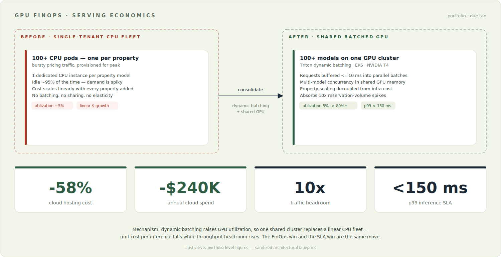
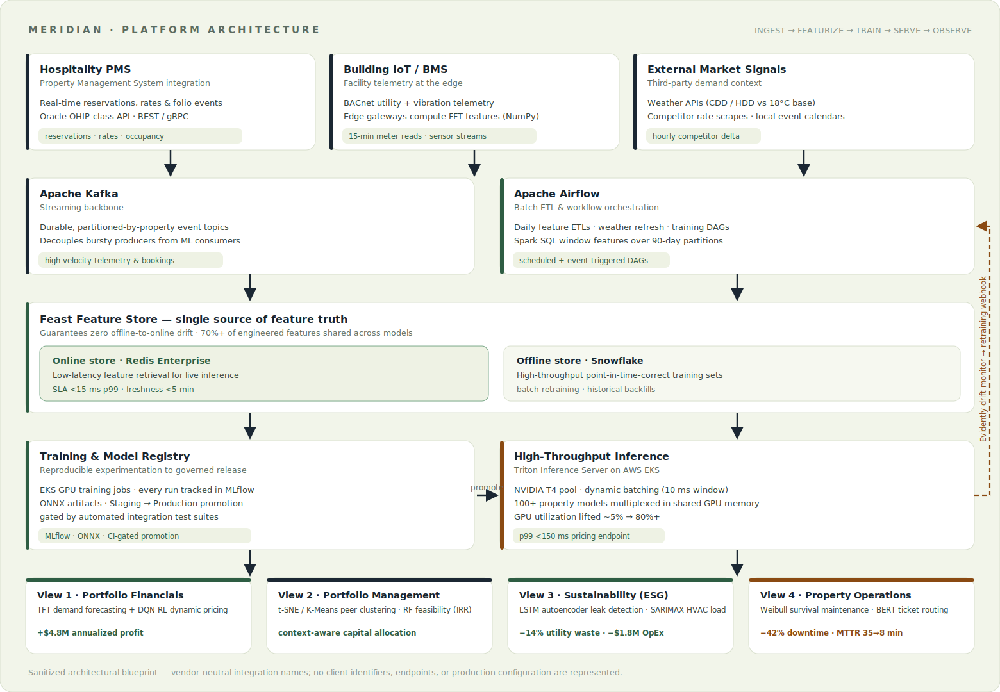
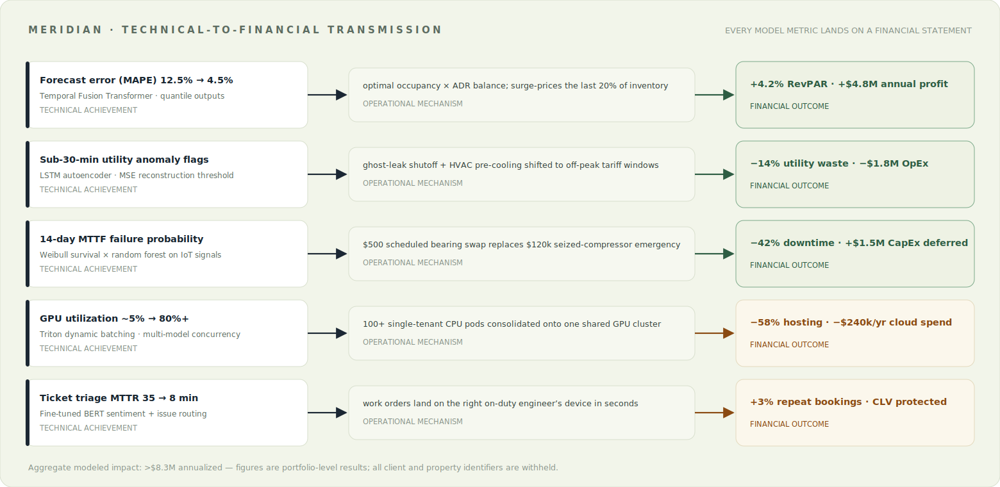
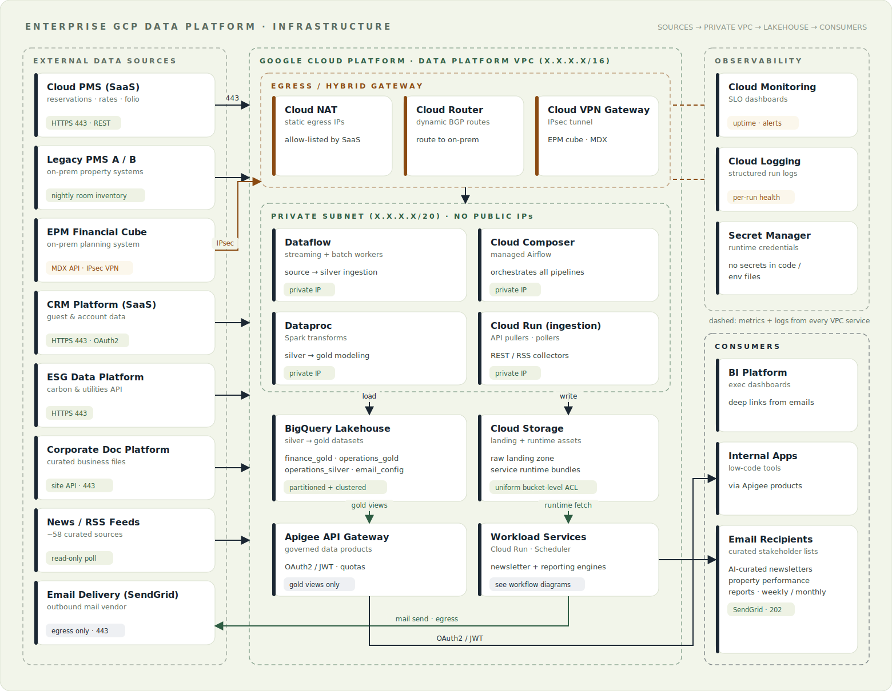
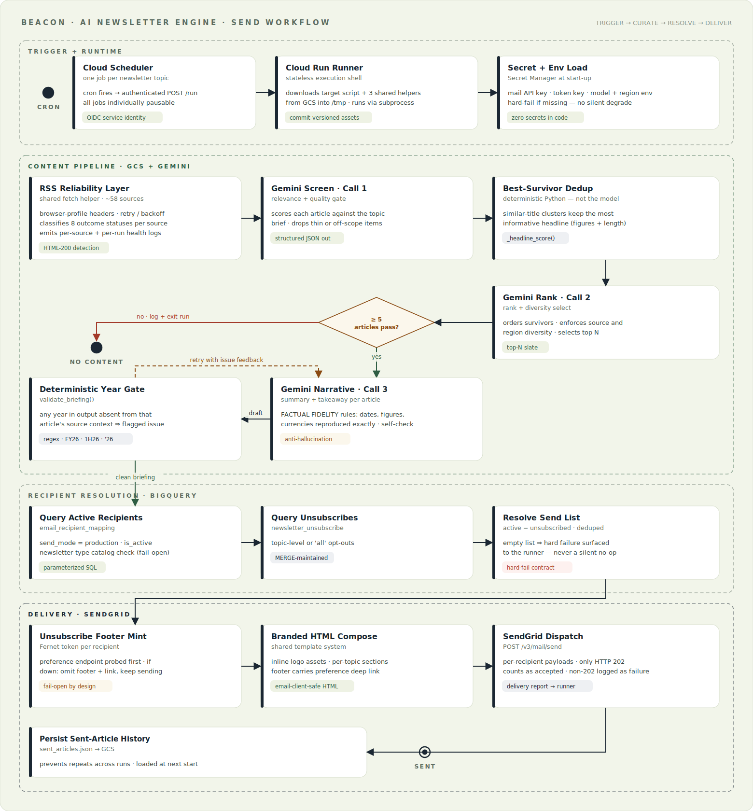
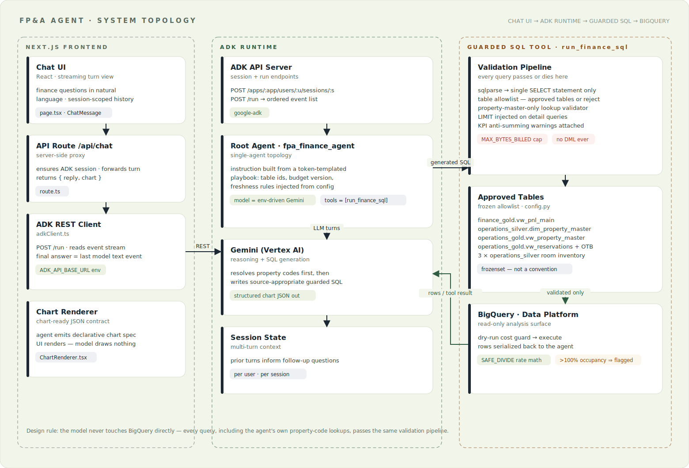
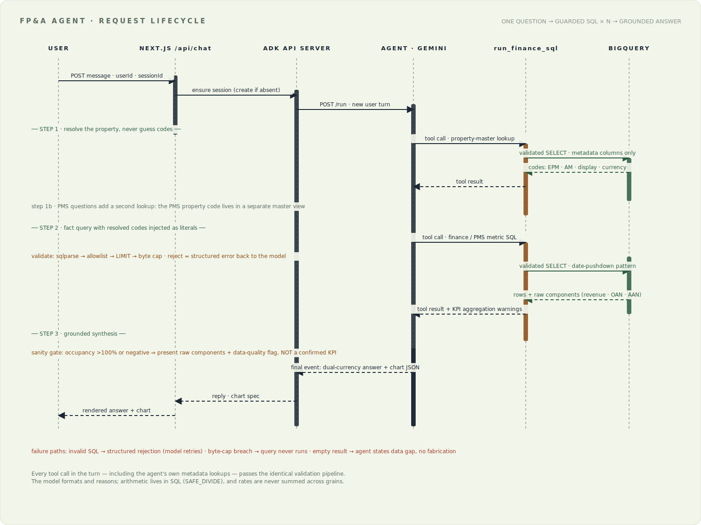
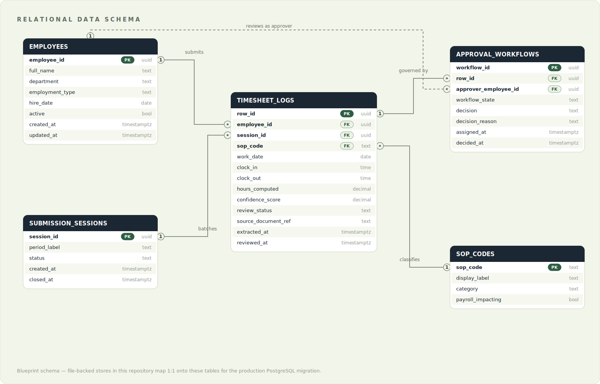
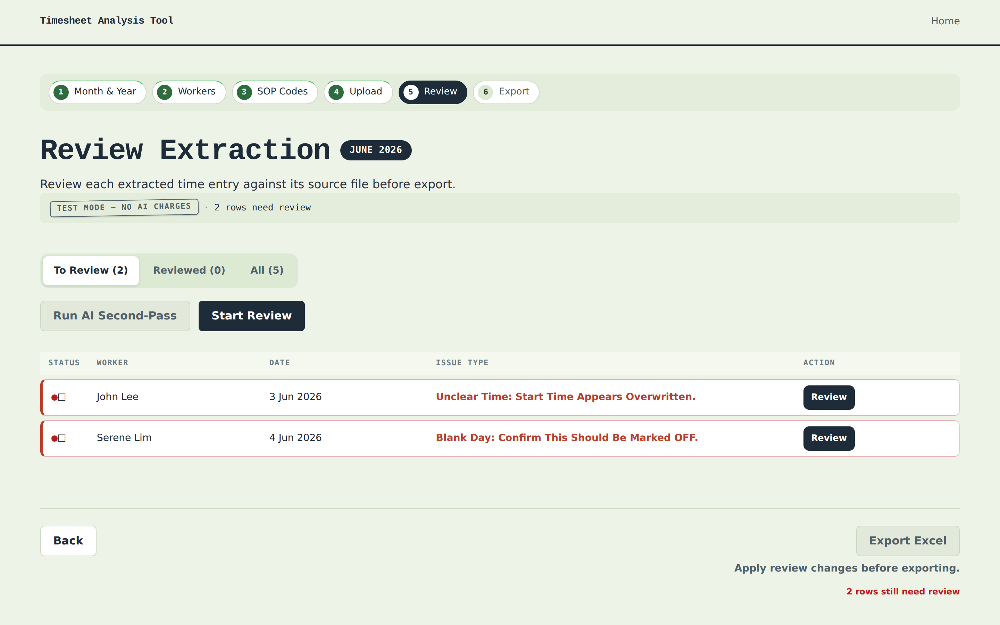

# Dae Tan — AI Infrastructure Solutions Engineer

### I architect the platform, model the TCO, and close the business case.

The rare hybrid an infra-sales team actually needs: hands-on AI-infrastructure and MLOps engineering — **NVIDIA Triton · AWS EKS · GPU serving · GCP · BigQuery** — paired with **~$700K in closed B2B revenue**. I turn latency, throughput, and GPU-utilization numbers into P&L outcomes a buyer will sign for.

> Most solutions-engineering candidates are engineers who can't run a deal, or closers who can't read an architecture. I'm the intersection: I've shipped production GPU-serving and MLOps infrastructure **and** carried a quota to ~$700K. This portfolio is the proof of both halves — sanitized architectural blueprints of real production systems, each wired to the business case that funds it.

---

## Why this profile fits AI-infrastructure sales

| I build it | I sell it |
|---|---|
| Consolidated 100+ single-tenant CPU pods onto a shared, dynamically batched **Triton / EKS GPU** cluster: utilization ~5% → **80%+**, hosting **−58%**, 10× traffic headroom at **p99 < 150 ms** | **~$700K** cumulative B2B revenue closed; promoted to Sales Lead running a 4-person team; consistently **+30% over quota** |
| Re-architected **Kafka · Airflow · Feast · Redis · Snowflake** pipelines — feature latency **24 h → <5 min** | Full-cycle ownership: prospecting → qualification → **PoC scoping** → ROI/TCO → close, on **Salesforce CRM** |
| Built an **ADK + BigQuery** natural-language agent — time-to-insight **hours → <1 min** | Translate architecture, SLA, and **GPU FinOps** into ROI/TCO business cases a CFO believes |
| Co-engineered an MLOps platform across 6 business units — forecast MAPE **12.5% → 4.5%** | Oxford (Saïd) AI executive programme · Google Cloud & Salesforce certified |

**The through-line:** I don't hand a customer a benchmark chart. I hand them a sentence they can repeat to their CFO — *"−$240K/year because utilization went 5%→80% via batching, and the freed headroom 10×'s our traffic without a re-architecture."*

---

## Value Engineering — from GPU metrics to the P&L

The artifact most portfolios are missing. An infra deal closes on a **TCO model a CFO believes** and a **PoC criterion an engineer trusts** — not a feature list. This is the move at the center of every project below:

Every model KPI is wired to a specific financial-statement line — the **five economic transmission paths**:

| Technical signal | Economic mechanism | P&L outcome |
|---|---|---|
| Forecast MAPE **12.5% → 4.5%** | Prices the last ~20% of inventory correctly | **+4.2% RevPAR → +$4.8M** profit |
| LSTM meter-anomaly detection | Overnight-leak flag in 30 min; HVAC load-shift off peak tariffs | **−14% utility waste → −$1.8M** OpEx |
| Weibull MTTF early-warning | Swap a $500 bearing, not a $120K seized compressor | **−42% downtime → −$1.5M** deferred CapEx |
| Triton shared-GPU batching | Linear CPU fleet → one dense cluster | **−58% hosting → −$240K/yr** |
| Fine-tuned BERT routing | MTTR **35 → 8 min** | **+3% repeat bookings** |

**→ The full playbook: [`docs/value-engineering.md`](docs/value-engineering.md)** — the value-based selling motion, the discovery/quantification question bank, and a reusable inference-serving TCO model.

---

## Projects

| # | Project | What it proves for infra sales | Core Stack | Quantified Outcome |
|---|---|---|---|---|
| 1 | **[MERIDIAN — Enterprise MLOps Platform](https://github.com/daetan999/mlops-hosp)** | GPU serving economics + technical-to-P&L translation | Triton · EKS · PyTorch · Feast · Kafka · MLflow | **>$8.3M** annualized across 5 value paths · GPU util **5%→80%** |
| 2 | **[Enterprise GCP Data & Intelligence Platform](https://github.com/daetan999/gcp-data-platform-blueprint)** | Serverless FinOps + private-VPC governance at scale | GCP · BigQuery · Cloud Run · Gemini · SendGrid | **7 AI newsletters + 2 report cadences, fully unattended** — curation hours → zero |
| 3 | **[Agentic FP&A Analytics](https://github.com/daetan999/adk-fpa-agent-blueprint)** | LLM cost/safety guardrails buyers ask about | Google ADK · Gemini · BigQuery · Next.js | Self-serve finance Q&A with **zero ungoverned SQL** · time-to-insight **hours → <1 min** |
| 4 | **[HR Timesheet Tool](https://github.com/daetan999/hr_timesheet_tool)** | End-to-end delivery a customer can adopt | Python · FastAPI · Jinja2 · PyMuPDF · openpyxl | Payroll cycle **days → minutes** · **95%+** manual processing eliminated |
| 5 | Semiconductor Analysis Platform *(private · publication pending)* | Quant depth + AI conviction modeling | Python · Flask · DCF · options greeks · Gemini | ~22k-line platform: DCF, IV-rank, regime-aware AI conviction |

Every public project is a **sanitized blueprint of a production system**: client identifiers, internal codenames, credentials, endpoints, and proprietary integrations are removed or mocked — the architecture, the engineering judgment, and the measured business impact are what remain. All diagrams are hand-built SVG (rendered natively by GitHub) with Mermaid diagram-as-code sources alongside in each repo.

---

## 1 · MERIDIAN — Enterprise MLOps Platform

Eight model families — quantile demand forecasting (Temporal Fusion Transformer), a bounded-action **DQN reinforcement-learning pricing agent**, LSTM-autoencoder ESG anomaly detection, Weibull survival predictive maintenance, fine-tuned BERT ticket routing — on one shared data and serving backbone, with fully automated drift-triggered retraining (no human in the hot path).

> **Infra-buyer's-eye value:** this is the GPU-serving TCO story in full — 100+ models consolidated onto a dynamically batched T4 cluster, with an explicit p99 SLA and a five-path map from model metrics to the P&L.

**Principal-level engineering signals:**

- **Serving economics** — Triton dynamic batching consolidated 100+ single-tenant CPU pods onto a small shared GPU cluster: utilization ~5% → 80%+, hosting spend **−58% (−$240K/yr)**, 10× traffic headroom at **p99 < 150 ms**.
- **A feature store as the contract** — Feast with Redis online (< 15 ms p99) and Snowflake offline guarantees zero training/serving skew; 70%+ feature reuse cut new-feature delivery from months to days.
- **Self-correcting production** — Evidently drift tiers (warn / auto-retrain / halt-and-page) reduced manual model maintenance by 85%.
- **Metrics that land on the P&L** — every model KPI maps to a financial statement line:

**→ Full blueprint: [`mlops-hosp`](https://github.com/daetan999/mlops-hosp)**

---

## 2 · Enterprise GCP Data & Intelligence Platform

A production GCP platform for a multinational hospitality group: a **no-public-IP private-VPC lakehouse** (Dataflow / Composer / Dataproc → BigQuery silver/gold, hybrid IPsec to on-prem financial systems) carrying two serverless products — seven AI-curated executive newsletters and weekly/monthly property performance reports.

> **Infra-buyer's-eye value:** serverless FinOps (pay-per-run runners, scheduler-paused by default) plus the private-VPC + governance posture a security-conscious enterprise buyer requires before they'll adopt anything.

**Principal-level engineering signals:**

- **A three-layer anti-hallucination stack** — prompt fidelity contract, in-prompt self-check, and a deterministic year-gate validator that feeds the retry loop; born from a real LLM date-mutation incident, now structurally prevented.
- **Fail-open vs hard-fail contracts** — every failure mode is deliberately classified: a preference-API outage degrades footers but never blocks sends, while an empty recipient list is a surfaced incident, never a silent no-op.
- **Config as data** — newsletter topics live in a BigQuery catalog table; registering a topic is one guarded `MERGE`, zero code changes.
- **Migration discipline** — nine services promoted sandbox → UAT → production with paused-by-default schedulers, send-disabled dry runs, and a single-operator test lane.

**→ Full blueprint: [`gcp-data-platform-blueprint`](https://github.com/daetan999/gcp-data-platform-blueprint)** — infrastructure, workflow and unsubscribe-flow diagrams, reliability contracts, migration playbook, runnable SQL shapes.

---

## 3 · Agentic FP&A Analytics — Guarded-SQL ADK Agent

An LLM agent on **Google's Agent Development Kit** that answers natural-language finance and operations questions — P&L lines, ADR, RevPAR, occupancy — with grounded, dual-currency, chart-ready answers. The engineering thesis: **an analytics agent is only as trustworthy as the guardrails around its SQL.**

> **Infra-buyer's-eye value:** the cost-control and safety story every AI-infra buyer probes — a byte-billing cost cap, a frozen table allowlist, and single-SELECT parsing so the model can never run away with the warehouse bill or the data.

**Principal-level engineering signals:**

- **One guarded tool as the choke point** — frozen table allowlist, single-SELECT parsing, byte-billing cost cap, injected row limits, KPI anti-summing semantics; the model never touches the warehouse directly.
- **Two-step property resolution** — three source systems use three different property-code schemes; the agent resolves codes through mandatory master lookups before any fact query.
- **Honest uncertainty** — impossible computed results (occupancy > 100%) are presented as flagged data-quality findings with raw components, never as answers.
- **An 11-entry lessons-learned engineering log** — every production failure class (JOIN explosion, scan-limit blowups, silent source fallback, duplicate-row inflation) converted into a structural safeguard.

**→ Full blueprint: [`adk-fpa-agent-blueprint`](https://github.com/daetan999/adk-fpa-agent-blueprint)** — topology, request-lifecycle sequence, deployment view, lessons-learned log.

---

## 4 · HR Timesheet Tool — Workforce Time-Capture Blueprint

An automated capture-to-payroll workflow replacing paper time cards and spreadsheet reconciliation: structured ingestion of scanned time cards, deterministic validation with exception surfacing, an exception-driven HR review queue, and payroll-ready Excel export — server-rendered FastAPI/Jinja2 with a pluggable (mocked) extraction layer.

> **Infra-buyer's-eye value:** proof I can take a solution the whole way to adoption — real UX, real data model, real hand-off — not just a diagram.

| Relational schema, designed for 1:1 SQL promotion | Product — exception-driven review queue |
| --- | --- |
|  |  |

**→ Full blueprint: [`hr_timesheet_tool`](https://github.com/daetan999/hr_timesheet_tool)**

---

## 5 · Semiconductor Analysis Platform *(private)*

A ~22,000-line personal quant research platform for the semiconductor sector: DCF valuation engine, options greeks and IV-rank analytics, alpha regression, strategy optimization, and a Gemini-based analyst layer with regime-aware confidence scoring — Flask-served with a full report UI. Built on public market data; repository publication pending final cleanup.

---

## Engineering + Commercial Competency Matrix

| Discipline | Evidenced By | Technologies |
|---|---|---|
| **AI-Infra Solutions Engineering** | GPU serving economics, TCO/ROI modeling, PoC scoping, technical-to-P&L value maps | Triton · EKS · GPU FinOps · ROI/TCO · Salesforce |
| **Commercial / GTM** | ~$700K B2B closed, Sales Lead over a 4-person team, +30% over quota, full-cycle pipeline ownership | Prospecting · qualification · solution pitching · closing · CRM |
| **MLOps & Model Serving** | MERIDIAN registry-gated CD, drift-triggered retraining, GPU serving economics | MLflow · ONNX · Triton · Evidently · EKS/Kubernetes |
| **ML Engineering** | Quantile TFT forecasting, DQN RL with bounded action spaces, LSTM autoencoders, survival analysis, fine-tuned BERT | PyTorch · pytorch-forecasting · scikit-learn |
| **Agentic AI** | Guarded-SQL ADK finance agent: allowlisted BigQuery tool, two-step property-code resolution, grounded chart output | Google ADK · Gemini · BigQuery · Next.js |
| **Cloud Data Platforms (GCP)** | Private-VPC lakehouse, serverless runner pattern, config-as-data recipient model, UAT→PRD migration playbook | BigQuery · Cloud Run · Dataflow · Composer · Cloud Scheduler · Secret Manager |
| **LLM Reliability Engineering** | Deterministic anti-hallucination year gate; KPI sanity gates that flag impossible values; fail-open vs hard-fail contracts | Gemini · prompt fidelity contracts · deterministic validators |
| **Data Platforms & Streaming** | Dual-layer Feast feature store, Kafka streaming, Spark SQL window features, warehouse modeling | Feast · Kafka · Airflow · Spark · Snowflake · Redis |
| **Architecture Communication** | Every repo: diagrams-as-code, hand-built SVG system diagrams, ERDs, sequence diagrams, value-transmission maps | SVG · Mermaid · UML |

---

## How These Blueprints Are Built

1. **Confidentiality inventory** — every project name, client identifier, dataset/table name, endpoint, and credential in the source system is catalogued before anything is published.
2. **Sanitize, don't lobotomize** — identifiers are renamed or mocked; architecture, data models, SLOs, and failure-mode engineering are preserved faithfully.
3. **Diagrams as code** — system diagrams are generated SVG (strict-XML-valid, GitHub-native rendering) with Mermaid sources embedded for maintainability.
4. **Impact stays quantified** — business results are kept as aggregated, portfolio-level figures with the mechanism that produced them, because architecture without outcomes is decoration.

---

## Let's talk

I'm looking to break into **AI-infrastructure solutions engineering / sales engineering**. If you're building out a technical pre-sales team, I bring the rare combination of production infra depth and a real closing record.

📧 **daetan999@gmail.com**  ·  🐙 **[github.com/daetan999](https://github.com/daetan999)**

---

## License

Portfolio content and diagrams released under the MIT License.
