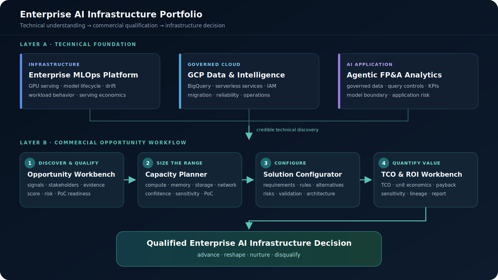

# Enterprise AI Infrastructure Portfolio

Technical platforms and commercial decision tools spanning AI workload discovery, capacity planning, solution configuration, and value engineering.

The projects follow an enterprise AI infrastructure opportunity from technical understanding and customer discovery to sizing, architecture recommendations, and a transparent TCO/ROI business case.

[Explore the seven projects](#portfolio-at-a-glance) · [Read the value-engineering playbook](docs/value-engineering.md) · [Use the resume mapping](docs/resume-project-mapping.md) · [Open the portfolio handover](docs/portfolio-handover.md)

## Positioning

The work is organized around one commercial-technical progression:

1. Understand AI infrastructure, MLOps, governed cloud platforms, and enterprise AI applications.
2. Discover the workload, buying motion, evidence quality, and decision risk.
3. Estimate an indicative capacity range and commercial opportunity band.
4. Convert requirements into an explainable solution hypothesis.
5. Quantify cost, value, sensitivity, and decision confidence.
6. Advance, reshape, nurture, or disqualify with a reviewable record.

The intended signal is a commercially minded AI infrastructure practitioner with enough technical depth to qualify opportunities and communicate credibly with engineering, operations, procurement, and financial stakeholders. Formal architecture, benchmarking, security, legal, and finance reviews remain separate approval gates.

## Evidence and Public-Safety Boundary

- Every bundled account, organization, workload, price, stakeholder, and result is synthetic, fictional, sanitized, or labelled illustrative.
- The four commercial workbenches use deterministic scoring, sizing, rules, or financial engines; model-generated text cannot silently change the result.
- The three technical-foundation repositories are sanitized reference blueprints. Their READMEs distinguish published code and contracts from omitted integrations and deployment environments.
- No project claims customer deployment, live vendor pricing, guaranteed ROI, or a final bill of materials.
- The repositories contain no public credentials, private project IDs, customer records, or employer source code.

## Portfolio at a Glance

### Layer A: Technical Foundation

Use these projects to establish the infrastructure, governed-cloud, and enterprise-application knowledge needed for credible discovery.

#### 1. [Enterprise MLOps Platform](https://github.com/daetan999/mlops-hosp)

**Purpose:** Explain how data, features, training, registry gates, GPU serving, and drift response operate as one ML platform.

- **Portfolio role:** Infrastructure and workload understanding
- **Core technologies:** PyTorch, MLflow, Feast, Kafka, Airflow, EKS, NVIDIA Triton
- **Key evidence:** Representative model contracts, feature definitions, orchestration shapes, Triton/Kubernetes configuration, architecture diagrams, and a falsifiable GPU-serving PoC
- **Implementation status:** Published sanitized reference blueprint; proprietary integrations and an end-to-end deployment are excluded

#### 2. [GCP Data & Intelligence Platform](https://github.com/daetan999/gcp-data-platform-blueprint)

**Purpose:** Show how governed data, serverless services, integration boundaries, and reversible operations support enterprise AI products.

- **Portfolio role:** Enterprise cloud and governed-data delivery
- **Core technologies:** BigQuery, Cloud Run, Cloud Scheduler, Cloud Storage, Gemini, SendGrid
- **Key evidence:** Service contracts, deterministic KPI structures, synthetic SQL operations, failure policies, four architecture diagrams, and a sanitized migration playbook
- **Implementation status:** Published sanitized architectural blueprint; cloud resources and proprietary provider integrations are not included

#### 3. [Agentic FP&A Analytics](https://github.com/daetan999/adk-fpa-agent-blueprint)

**Purpose:** Define how an analytics agent should be constrained by approved data, KPI semantics, query cost, source resolution, and model responsibility.

- **Portfolio role:** Governed enterprise AI application design
- **Core technologies:** Google ADK, Gemini, BigQuery, Next.js, Python
- **Key evidence:** Approved-table and measure contracts, partial proxy/client boundaries, synthetic property data, control-flow diagrams, and sanitized lessons learned
- **Implementation status:** Published control blueprint; guarded execution, the complete frontend, authentication, and deployment do not run in the public tree

### Layer B: Commercial AI Infrastructure Workflow

The four runnable local prototypes support one seller workflow. Each has fictional demos, visible assumptions, tests, screenshots, Docker support, and a production boundary.

#### 4. [AI Infrastructure Opportunity & Discovery Workbench](https://github.com/daetan999/ai-infra-opportunity-workbench)

**Purpose:** Turn account signals, workload hypotheses, stakeholder evidence, and discovery answers into an explainable qualification decision.

- **Portfolio role:** Discover and qualify
- **Core technologies:** FastAPI, SQLAlchemy, SQLite, Jinja2, Python
- **Key evidence:** Three fictional accounts, evidence provenance, buying-group mapping, deterministic component scores, single-threading risk, PoC readiness, and BDR-to-AE handoff export
- **Implementation status:** Runnable local prototype with 96% branch coverage and a clean-checkout container workflow

#### 5. [Enterprise AI Capacity & Commercial Sizing Planner](https://github.com/daetan999/ai-infra-capacity-planner)

**Purpose:** Produce editable first-pass infrastructure ranges and a commercial opportunity band before formal benchmarking.

- **Portfolio role:** Size the workload and opportunity
- **Core technologies:** FastAPI, Pydantic, SQLite, YAML, Jinja2, Python
- **Key evidence:** Training, inference, RAG, vision, and batch/HPC modes; configurable accelerator profiles; sensitivity ranges; confidence and missing-evidence warnings; comparison and export
- **Implementation status:** Runnable local prototype; outputs are indicative ranges, not a quote or final bill of materials

#### 6. [Enterprise AI Solution Configurator](https://github.com/daetan999/ai-infra-solution-configurator)

**Purpose:** Translate customer requirements into a structured solution hypothesis with rationale, alternatives, risks, and required validation.

- **Portfolio role:** Configure the solution
- **Core technologies:** FastAPI, Pydantic, SQLite, Jinja2, deterministic SVG generation
- **Key evidence:** Versioned rules, immutable assessment runs, guided requirements, three fictional scenarios, downloadable solution briefs, and presentation-ready architecture diagrams
- **Implementation status:** Runnable local prototype with two Playwright browser journeys and a clean-checkout container build

#### 7. [Enterprise AI Infrastructure TCO & ROI Workbench](https://github.com/daetan999/ai-infra-tco-workbench)

**Purpose:** Convert architecture and workload assumptions into traceable cost, value, sensitivity, payback, and executive decision evidence.

- **Portfolio role:** Quantify the business case
- **Core technologies:** FastAPI, Decimal-based Python engine, SQLite, ReportLab, Playwright
- **Key evidence:** Three- and five-year TCO, unit economics, ROI, payback, four-way sensitivity, evidence-weighted confidence, calculation lineage, immutable versions, and JSON/CSV/PDF exports
- **Implementation status:** Runnable local prototype; 51 Python tests, 94.67% branch coverage, three Chromium journeys, and a sample five-page fictional report

## How the Projects Connect

| Decision stage | Primary artifact | Question answered | Output passed forward |
|---|---|---|---|
| Technical context | MLOps, GCP, and FP&A blueprints | What infrastructure, governance, and application constraints matter? | Credible discovery scope and control requirements |
| Opportunity discovery | Opportunity Workbench | Is the problem real, evidenced, multithreaded, and worth progressing? | Qualified workload, stakeholders, risks, and next action |
| First-pass sizing | Capacity Planner | What indicative capacity and commercial range should be validated? | Range, bottleneck hypothesis, missing inputs, and PoC measurements |
| Solution workshop | Solution Configurator | Which architecture pattern fits the requirements and trade-offs? | Explainable solution hypothesis, alternatives, risks, and diagram |
| Value engineering | TCO & ROI Workbench | Is the proposed change financially defensible under sensitivity? | Business case, calculation lineage, report, and decision posture |

A reviewer can recommend advance, reshape, nurture, or disqualify when evidence, technical fit, access, economics, or risk is insufficient.

## Supporting Materials

- [Value Engineering: From GPU Metrics to the P&L](docs/value-engineering.md) connects utilization, latency, reliability, and operating effort to business hypotheses.
- [TCO Worked Example](docs/tco-worked-example.md) walks a fictional inference-serving case from discovery to a falsifiable PoC and financial narrative.
- [Resume Project Mapping](docs/resume-project-mapping.md) provides recruiter-facing descriptions, bullets, skill signals, and recommended four-project sets.
- [Portfolio Handover](docs/portfolio-handover.md) records run commands, demos, tests, screenshots, diagrams, limitations, and review actions.

## Review Guide

For a five-minute commercial review:

1. Read the system map and the four commercial-workflow summaries.
2. Open the Opportunity Workbench screenshot and its qualification model.
3. Inspect the TCO Workbench comparison screenshot and sample report.
4. Use the resume mapping to select role-specific evidence.

For a technical review:

1. Inspect the deterministic engine or rules module in each commercial workbench.
2. Read the method, guardrail, or architecture document beside it.
3. Run the repository's documented test and container commands.
4. Compare the screenshots and exports with the tested output paths.

## Primary Resume Link

Use this URL in the resume header:

**https://github.com/daetan999/technical_resume**

Individual repository links can be attached to project headings when the resume format supports them.

## License

Portfolio documentation is released under the [MIT License](LICENSE). Each linked repository carries its own license and public-artifact boundary.
