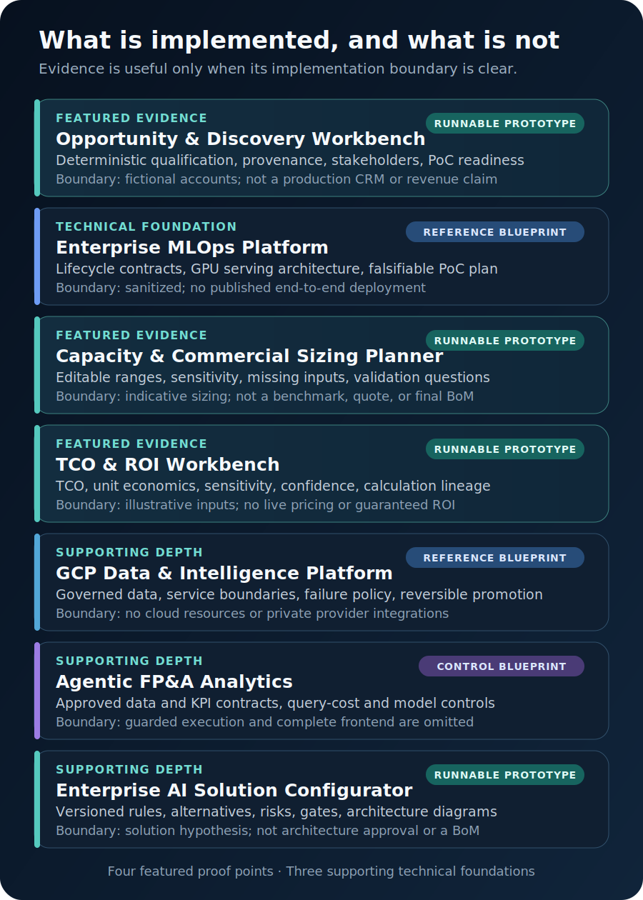
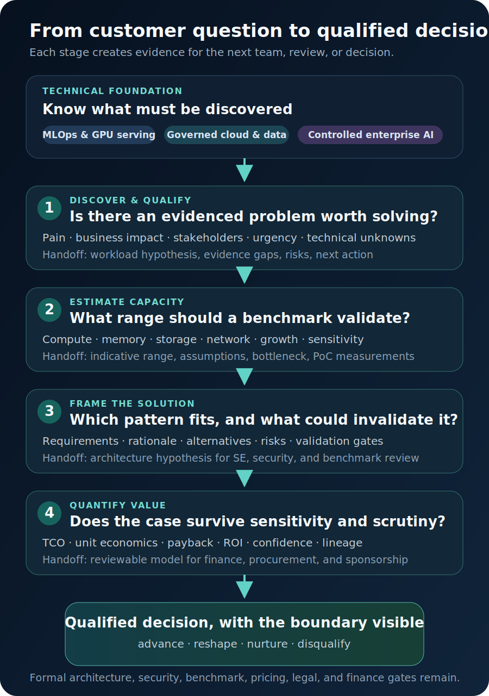

# Dae Tan | Enterprise AI Infrastructure Portfolio

Technical evidence for AI infrastructure discovery, solution framing, capacity planning, and value engineering.

My background connects finance and commercial analysis, B2B pipeline ownership, consulting, and enterprise data and AI delivery. I built this portfolio to show the technical layer behind that experience: workload discovery, governed cloud and MLOps foundations, first-pass sizing, explainable solution framing, and deterministic TCO analysis.

The goal is not to present myself as a pure seller or a pure software engineer. It is to show how I work between customer priorities and technical teams, turning incomplete requirements into evidence that an Account Executive, Solutions Engineer, infrastructure specialist, finance partner, or procurement team can review.

[Explore the featured evidence](#featured-evidence) · [Read the value-engineering method](docs/value-engineering.md) · [Map projects to a resume](docs/resume-project-mapping.md)

## The Story This Portfolio Supports

The paper resume carries career chronology, role scope, and verified business results. This technical resume supplies the evidence behind the next step in that story:

1. Understand how AI workloads, data controls, serving patterns, and infrastructure constraints interact.
2. Discover the business problem, stakeholder map, evidence quality, and technical unknowns.
3. Estimate an indicative capacity range and define what a benchmark or proof of concept must validate.
4. Frame an explainable solution hypothesis with alternatives, risks, and approval gates.
5. Quantify cost, value, sensitivity, and confidence without presenting assumptions as outcomes.

These artifacts support technical-commercial collaboration. They do not replace formal architecture, security, benchmark, pricing, legal, or finance approval.

## Featured Evidence

These four projects tell the clearest default story for an AI infrastructure solutions role.

### 1. [Opportunity & Discovery Workbench](https://github.com/daetan999/ai-infra-opportunity-workbench)

**What it proves:** I can structure ambiguous account signals and discovery inputs into a transparent qualification decision.

**Evidence:** Deterministic scoring, evidence provenance, buying-group mapping, single-threading warnings, PoC readiness, and a structured BDR-to-AE handoff. The audited build included 76 tests, 96%+ branch coverage, and a clean container workflow.

**Boundary:** Fictional accounts and decision-support logic, not a production CRM or a claim of closed-won results.

### 2. [Enterprise MLOps Platform](https://github.com/daetan999/mlops-hosp)

**What it proves:** I understand the operating chain behind an enterprise ML workload, from data and features through training gates, model packaging, GPU serving, and drift response.

**Evidence:** PyTorch, MLflow, Feast, Kafka, Airflow, Kubernetes, and NVIDIA Triton contracts; architecture diagrams; and a falsifiable GPU-serving PoC plan that measures utilization, throughput, latency, fleet size, and unit cost.

**Boundary:** A sanitized reference blueprint. Proprietary integrations and an end-to-end deployment are not published.

### 3. [Capacity & Commercial Sizing Planner](https://github.com/daetan999/ai-infra-capacity-planner)

**What it proves:** I can convert workload inputs into an editable first-pass range while keeping assumptions, sensitivity, missing evidence, and validation needs visible.

**Evidence:** Training, inference, RAG, vision, and batch/HPC modes; configurable accelerator profiles; compute, memory, storage, network, power, and commercial ranges; comparison and export. The audited build included 65 tests and 92%+ branch coverage.

**Boundary:** Indicative planning ranges, not vendor benchmarks, a quote, or a final bill of materials.

### 4. [TCO & ROI Workbench](https://github.com/daetan999/ai-infra-tco-workbench)

**What it proves:** I can translate technical and operating assumptions into a reviewable financial model rather than a black-box savings claim.

**Evidence:** Decimal-based three- and five-year TCO, unit economics, payback, ROI, four-way sensitivity, evidence-weighted confidence, immutable versions, calculation lineage, and JSON/CSV/PDF exports. The audited build included 51 collected test cases across Python and browser suites, branch-coverage enforcement, and container CI.

**Boundary:** Fictional or user-entered assumptions, not live pricing, financial advice, or guaranteed ROI.

## Supporting Technical Depth

Three additional repositories extend the primary narrative.

- [GCP Data & Intelligence Platform](https://github.com/daetan999/gcp-data-platform-blueprint): governed BigQuery data, serverless boundaries, failure policies, and reversible environment promotion.
- [Agentic FP&A Analytics](https://github.com/daetan999/adk-fpa-agent-blueprint): approved data and KPI contracts, query-cost controls, source resolution, and explicit model responsibility.
- [Enterprise AI Solution Configurator](https://github.com/daetan999/ai-infra-solution-configurator): guided requirements, versioned rules, alternatives, risks, validation gates, and deterministic architecture diagrams, supported by 80 tests in the audited build.

## From Discovery to a Defensible Decision

The artifacts are designed to hand evidence forward, not force a positive outcome.

At each stage, the next action may be to advance, reshape, nurture, or disqualify. Confidence should fall when workload data, stakeholder access, technical fit, security requirements, benchmark evidence, or commercial assumptions are weak.

## Evidence and Public Boundary

- Scenarios and outcomes are synthetic, fictional, sanitized, or clearly illustrative.
- Deterministic engines control scoring, sizing, recommendations, and financial results.
- Foundation repositories separate published contracts from omitted integrations and environments.
- No artifact claims customer deployment, guaranteed performance, live pricing, final architecture approval, or guaranteed ROI.

## Supporting Materials

- [Value Engineering Method](docs/value-engineering.md) maps technical signals to cost, risk, capacity, and business-value hypotheses.
- [TCO Worked Example](docs/tco-worked-example.md) follows one fictional private-RAG scenario from discovery inputs to a falsifiable validation plan.
- [Portfolio Case Contract](docs/portfolio-case-contract.md) keeps the Northstar workload and stage ownership consistent across the commercial workbenches.
- [Resume Project Mapping](docs/resume-project-mapping.md) provides accurate project descriptions and role-specific four-project selections.

<strong>Five-minute review path</strong>

1. Read the career bridge and four featured summaries.
2. Inspect the Opportunity qualification model.
3. Inspect Capacity assumptions and sensitivity.
4. Inspect TCO calculation lineage and its fictional sample report.

## Primary Resume Link

**https://github.com/daetan999/technical_resume**

## License

Portfolio documentation is released under the [MIT License](LICENSE). Each linked repository carries its own license and public-artifact boundary.
