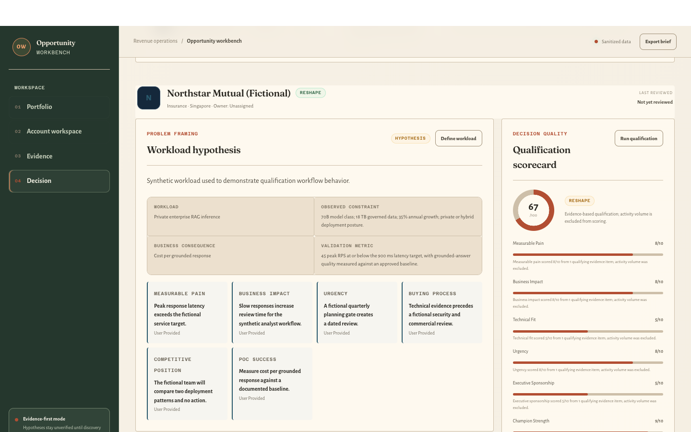
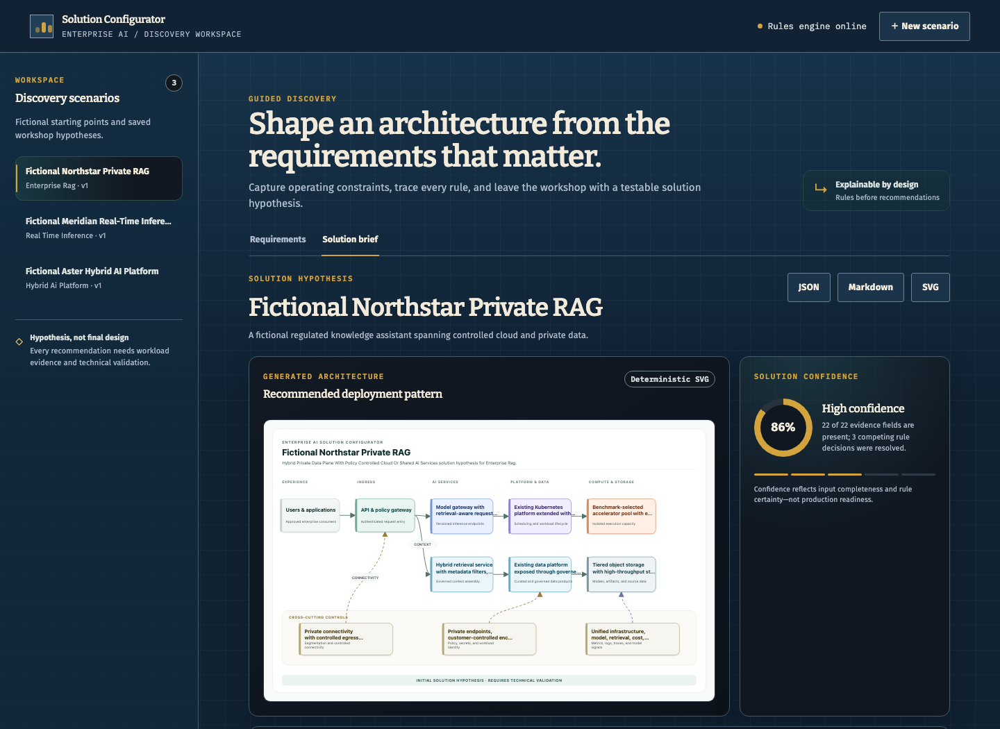
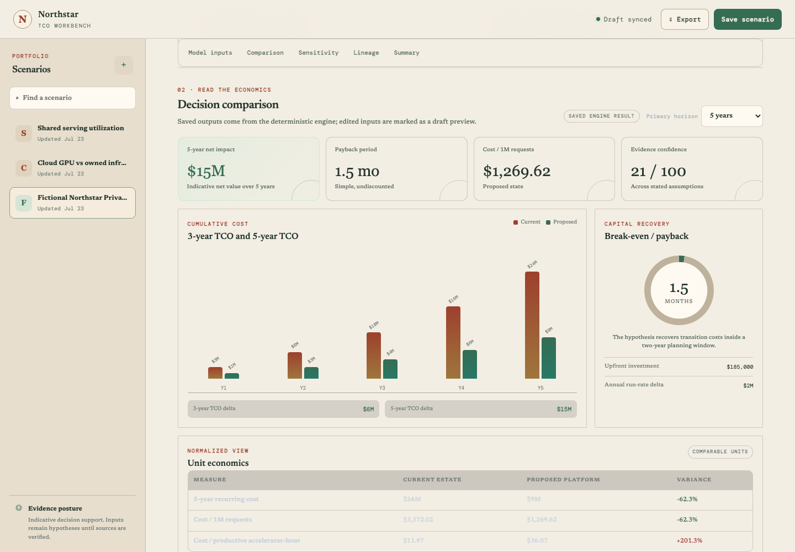

# Dae Tan | Technical Portfolio

Technical-commercial portfolio for AI infrastructure sales, account, and solutions roles. The four runnable workbenches below follow one decision from account evidence through workload sizing, solution framing, and financial review.

[LinkedIn](https://www.linkedin.com/in/dae-tan-1a2b3c) · [Worked Private-RAG case](docs/tco-worked-example.md) · [Value-engineering method](docs/value-engineering.md) · [Resume project mapping](docs/resume-project-mapping.md)

## Review the portfolio as one decision

| Stage | Question | Product | Reviewable output |
|---|---|---|---|
| Discover | Is there a specific, evidenced opportunity worth pursuing? | [Opportunity Workbench](https://github.com/daetan999/ai-infra-opportunity-workbench) | Workload hypothesis, stakeholder map, evidence gaps, and next action |
| Size | What infrastructure range and bottleneck require validation? | [Capacity Planner](https://github.com/daetan999/ai-infra-capacity-planner) | Low/base/high range, sensitivities, and an AE-to-SE validation plan |
| Configure | Which architecture hypothesis best fits the stated requirements? | [Solution Configurator](https://github.com/daetan999/ai-infra-solution-configurator) | Recommendation, alternatives, risks, diagram, and validation gates |
| Justify | Is the proposed change financially defensible? | [TCO Workbench](https://github.com/daetan999/ai-infra-tco-workbench) | TCO, unit economics, sensitivity, payback, ROI, and executive report |

The products share evidence and decision discipline, not a common dashboard skin. Each interface uses a visual system chosen for its work.

## Featured products

### 1. Opportunity & Discovery Workbench

**Account research, qualification, and bounded PoC handoff**

*A field-research journal for distinguishing sourced signals from seller interpretation.*

The workbench turns account signals, workload hypotheses, stakeholder access, and discovery notes into a transparent advance, reshape, nurture, or disqualify recommendation.

- **Decision contribution:** exposes weak evidence, single-threading, missing authority, and unresolved risk before solution resources are committed.
- **Engineering contribution:** implemented deterministic qualification, persistence, workflow APIs, a server-rendered interface, and JSON/Markdown exports.
- **Boundary:** fictional accounts and decision-support logic; not a production CRM, revenue forecast, or claim of customer outcomes.
- **Visual identity:** olive, clay, and ivory with Fraunces, Alegreya Sans, and Azeret Mono.

[`Open the Opportunity Workbench repository`](https://github.com/daetan999/ai-infra-opportunity-workbench)

---

### 2. Capacity & Commercial Sizing Planner

**First-pass workload sizing for an AE-to-SE conversation**

*An industrial planning desk that treats early sizing as measured work, not false precision.*

The planner converts workload assumptions into editable infrastructure and commercial ranges across training, fine-tuning, batch inference, real-time inference, and RAG.

- **Decision contribution:** identifies the binding compute, memory, storage, network, latency, or completion-window constraint and turns missing inputs into validation questions.
- **Engineering contribution:** built a deterministic sizing engine, YAML accelerator profiles, scenario persistence, comparison, sensitivity, and export workflows.
- **Boundary:** indicative planning ranges; not a benchmark, supplier quote, topology validation, or final bill of materials.
- **Visual identity:** graphite, safety orange, and brass with Barlow Semi Condensed and Azeret Mono.

[`Open the Capacity Planner repository`](https://github.com/daetan999/ai-infra-capacity-planner)

---

### 3. Enterprise AI Solution Configurator

**Requirements-led architecture recommendation and validation planning**

*An architectural blueprint workspace that keeps requirements, rules, and assumptions visible beside the proposed design.*

The configurator turns structured requirements into an explainable solution hypothesis, viable alternatives, risk notes, validation gates, and a controlled architecture diagram.

- **Decision contribution:** makes rule matches, exclusions, trade-offs, and unresolved requirements reviewable before an architecture is treated as approved.
- **Engineering contribution:** implemented versioned recommendation rules, deterministic diagram generation, scenario persistence, exports, and browser-tested decision flows.
- **Boundary:** an initial solution hypothesis; not a final architecture, security approval, benchmark, quote, or bill of materials.
- **Visual identity:** blueprint navy, paper blue, and ochre with Bitter, Fira Sans, and IBM Plex Mono.

[`Open the Solution Configurator repository`](https://github.com/daetan999/ai-infra-solution-configurator)

---

### 4. TCO & ROI Workbench

**Value engineering and executive business-case review**

*A financial broadsheet that presents assumptions and calculation lineage as an auditable decision record.*

The workbench compares operating models across three- and five-year TCO, unit economics, payback, modeled ROI, and sensitivity while preserving the inputs behind every result.

- **Decision contribution:** tests whether a recommendation remains defensible as utilization, compute price, growth, and energy assumptions change.
- **Engineering contribution:** built a Decimal-based financial engine, immutable scenario versions, evidence gating, sensitivity analysis, and JSON/CSV/PDF exports.
- **Boundary:** fictional or user-entered assumptions; not live pricing, financial advice, supplier terms, or guaranteed ROI.
- **Visual identity:** parchment, forest green, and oxblood with Newsreader and DM Mono.

[`Open the TCO Workbench repository`](https://github.com/daetan999/ai-infra-tco-workbench)

## Supporting technical foundations

The workbenches demonstrate decision support around an infrastructure sale. These architecture repositories provide additional implementation context without being presented as public production deployments.

| Project | Evidence it adds | Public boundary |
|---|---|---|
| [Enterprise MLOps Platform](https://github.com/daetan999/mlops-hosp) | Data, feature, model-lifecycle, GPU-serving, monitoring, rollout, and reliability context | Sanitized reference blueprint; proprietary data, integrations, images, clusters, and endpoints are excluded |
| [GCP Data & Intelligence Platform](https://github.com/daetan999/gcp-data-platform-blueprint) | Governed BigQuery data, Cloud Run operations, model boundaries, failure policies, and reversible environment promotion | Architecture blueprint rather than a complete deployable environment |

The [Agentic FP&A Analytics blueprint](https://github.com/daetan999/adk-fpa-agent-blueprint) is intentionally not featured: its governance concepts are useful, but the public repository does not implement the complete guarded execution, authentication, deployment, and evaluation path.

## Shared engineering approach

- Deterministic scoring, sizing, rule, and financial engines keep generated narrative from silently changing a decision.
- Fictional, synthetic, sanitized, or user-entered data is labelled and kept separate from professional-experience claims.
- Each runnable prototype documents setup, API boundaries, architecture, tests, exports, and known limitations in its own repository.
- Outputs remain hypotheses until the appropriate customer evidence, benchmarks, security review, supplier pricing, and technical approval replace illustrative assumptions.

## Interview review paths

**Thirty seconds:** scan the decision table and the four screenshots.

**Five minutes:** inspect Opportunity evidence quality, Capacity bottlenecks, Configurator rule explanations, and TCO sensitivity.

**Technical-commercial interview:** follow the [fictional Private-RAG case](docs/tco-worked-example.md) across discovery, sizing, architecture, and financial review; then inspect the deterministic engine in each repository.

## Accuracy standard

- No repository claims a live customer deployment, current vendor pricing, guaranteed performance, final architecture approval, or guaranteed ROI.
- Scenario values are portfolio evidence, not professional revenue, quota, or savings results.
- “Prototype,” “blueprint,” “benchmark,” “quote,” and “production deployment” are not used interchangeably.
- The [resume project mapping](docs/resume-project-mapping.md) keeps the one-page resume concise while this repository holds the complete technical evidence set.

## License

Portfolio documentation is released under the [MIT License](LICENSE). Each linked repository carries its own license and public-artifact boundary.
