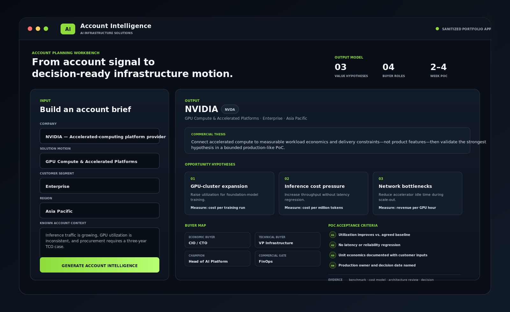
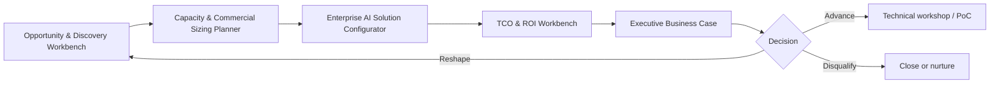

# Technical Project Portfolio

Selected projects across AI/ML infrastructure, cloud data platforms, agentic analytics, and enterprise AI-infrastructure selling workflows.

This repository is the **content map for the portfolio**. It separates:

- Current projects that can be inspected now
- Supporting value-engineering artifacts
- Planned products that still need to be built
- The role each project plays in an AI-infrastructure BDR, account-development, or early-career enterprise-sales story

The intended portfolio signal is not “software engineer.” It is **commercial capability supported by enough technical depth to discover, qualify, quantify, and communicate complex AI-infrastructure opportunities credibly**.

## Public Portfolio Scope

The repositories are sanitized project blueprints and public prototypes rather than production source-code dumps.

- Client and employer names, internal codenames, credentials, endpoints, project IDs, service accounts, production datasets, recipients, and proprietary integrations are removed, renamed, or mocked.
- Sample data and identifiers are synthetic.
- Representative interfaces, configuration patterns, architecture decisions, failure controls, and operating procedures are retained.
- Quantified outcomes are rounded or aggregated. Modeled figures are identified as such in the detailed project repositories.
- Current implementations, target-state designs, and illustrative components are labelled separately.
- Planned projects below are specifications only. They must not be presented as completed work until working repositories, tests, and rendered examples exist.

---

## Current Flagship Projects

| # | Project | Portfolio role | Core stack | Current evidence |
|---|---|---|---|---|
| 1 | **[Enterprise MLOps Platform](https://github.com/daetan999/mlops-hosp)** | Demonstrates technical understanding of the infrastructure being sold: GPU serving, orchestration, feature stores, model lifecycle, reliability, and FinOps | Triton · EKS · PyTorch · MLflow · Feast · Kafka · Snowflake · Redis | 100+ model deployments consolidated onto shared GPU serving; utilization ~5% → 80%+; p99 <150 ms; modeled hosting cost −58% |
| 2 | **[GCP Data & Intelligence Platform](https://github.com/daetan999/gcp-data-platform-blueprint)** | Demonstrates enterprise cloud delivery, managed services, governance, migration discipline, and business-facing AI products | GCP · BigQuery · Cloud Run · Cloud Scheduler · Gemini · SendGrid | Seven newsletter workflows, weekly/monthly reporting, nine serverless services, and unattended scheduled delivery |
| 3 | **[Agentic FP&A Analytics](https://github.com/daetan999/adk-fpa-agent-blueprint)** | Demonstrates governed enterprise AI applications, guarded data access, and communication of technical controls to business users | Google ADK · Gemini · BigQuery · Next.js · Python | Grounded dual-currency answers and charts through a single guarded SQL execution path |
| 4 | **[AI Infrastructure Account Intelligence](https://github.com/daetan999/Semis-Analysis-Web)** | Demonstrates account research, buying-group mapping, technical discovery, value hypotheses, objection preparation, and PoC qualification | FastAPI · Python · Gemini · Jinja2 · Docker | Generates three value hypotheses, a four-role buyer map, discovery and objection plans, and a measurable 2–4 week PoC structure |

The HR Timesheet Tool remains available as a separate repository, but it is no longer featured here because document-to-payroll automation does not strengthen the central AI-infrastructure sales narrative.

---

## 1. Enterprise MLOps Platform

A sanitized architecture blueprint for operating multiple machine-learning workloads on a shared data, feature, training, serving, and monitoring platform.

### Project scope

- Eight model families covering demand forecasting, constrained reinforcement-learning pricing, ESG anomaly detection, predictive maintenance, asset clustering, feasibility analysis, and NLP ticket routing.
- Kafka and Airflow pipelines feeding a Feast feature store with Redis for online access and Snowflake for point-in-time offline training data.
- PyTorch training, MLflow registry gates, ONNX packaging, EKS deployment, and NVIDIA Triton inference serving.
- Evidently-based monitoring with separate warning, automated retraining, and halt-and-page responses for different drift classes.

### Relevance to infrastructure sales

- Explains why GPU utilization, batching, latency, throughput, feature freshness, and model lifecycle affect customer economics.
- Provides the technical foundation needed to ask credible workload and architecture questions without positioning as the implementation engineer.
- Includes measurable PoC criteria around throughput, p99 latency, GPU utilization, and cost per inference.
- Supports conversations with both infrastructure teams and financial stakeholders.

### Key design decisions

- **Shared GPU serving:** dynamic batching and multi-model concurrency replace a linear single-tenant CPU deployment pattern.
- **Feature-store contract:** shared feature definitions reduce training-serving skew and support reuse across model families.
- **Registry-gated promotion:** models move through evaluation and staged promotion before serving.
- **Closed-loop operations:** monitored drift can trigger retraining while severe concept drift pauses automated pricing for human review.

**Repository:** [`mlops-hosp`](https://github.com/daetan999/mlops-hosp)

---

## 2. GCP Data & Intelligence Platform

A sanitized blueprint of an enterprise Google Cloud data platform and the serverless products running on top of it.

### Platform scope

- Private-VPC ingestion and processing using Dataflow, Dataproc, Composer, Cloud Run, Cloud Storage, and BigQuery silver/gold layers.
- Hybrid connectivity patterns for on-premises financial systems and governed access to curated data products.
- Seven topic-specific AI newsletter workflows using resilient RSS ingestion, Gemini-based curation, BigQuery-managed recipients, and SendGrid delivery.
- Weekly and monthly performance reporting with deterministic BigQuery calculations and model-generated narrative restricted to computed figures.

### Relevance to infrastructure sales

- Demonstrates familiarity with enterprise cloud estates rather than isolated application development.
- Shows how managed compute, data warehousing, networking, identity, secrets, scheduling, and observability fit together.
- Documents sandbox-to-UAT-to-production migration, rollback, failure handling, and cost-aware scale-to-zero services.
- Provides evidence for discussions about governance, deployment risk, integration, and operating ownership.

### Key design decisions

- **Scale-to-zero services:** Cloud Run and Cloud Scheduler support pay-per-run execution with no idle application compute.
- **Deterministic LLM controls:** prompt fidelity rules, model self-checks, and a code-level date validator reduce factual mutation.
- **Explicit failure contracts:** non-critical preference-link failures degrade safely, while missing recipients, delivery failures, stale data, and child-process errors fail the run.
- **Configuration as data:** newsletter types and recipient rules are managed through guarded BigQuery operations.
- **Controlled migration:** sandbox, UAT, and production promotion use paused schedulers, disabled-send dry runs, validation checks, and rollback steps.

**Repository:** [`gcp-data-platform-blueprint`](https://github.com/daetan999/gcp-data-platform-blueprint)

---

## 3. Agentic FP&A Analytics

A Google ADK agent for natural-language finance and operational analysis over governed BigQuery data. The project separates the working development implementation from the proposed production deployment design.

### Project scope

- Natural-language questions across P&L measures, budget variance, occupancy, ADR, RevPAR, and property performance.
- Google ADK runtime with Gemini on Vertex AI and a Next.js chat interface.
- Dual-currency answers and declarative chart specifications grounded in query results.
- Multi-source property resolution where finance, asset-management, and property-management systems use different identifiers.

### Guarded SQL execution

All warehouse access passes through one tool that applies:

- Single-statement, `SELECT`-only parsing
- Frozen approved-table allowlist
- Per-query byte-billing cap
- Automatic row limits for detail queries
- Restricted property-master lookup shapes
- Warnings for non-additive measures such as ADR, RevPAR, and occupancy
- Data-quality handling for impossible outputs rather than silent correction

### Relevance to infrastructure sales

- Demonstrates how an AI application depends on governed data access, model controls, identity, cost limits, and deployment architecture.
- Provides a concrete workload for discovery conversations about enterprise AI adoption.
- Shows the difference between a prototype, a production design, and a deployable operating model.

### Delivery status

- **Current development implementation:** ADK API server and Next.js frontend with read-only BigQuery access.
- **Target production design:** managed agent hosting, Cloud Run frontend, enterprise authentication, and a dedicated least-privilege service identity.

**Repository:** [`adk-fpa-agent-blueprint`](https://github.com/daetan999/adk-fpa-agent-blueprint)

---

## 4. AI Infrastructure Account Intelligence

A runnable account-planning workbench for AI-infrastructure solution selling. It turns a company, solution motion, customer segment, and known context into a structured commercial and technical brief.

The rendered example shows an enterprise NVIDIA GPU-compute motion: three measurable opportunity hypotheses, four buyer roles, and a bounded 2–4 week PoC with explicit acceptance criteria.

### Commercial value demonstrated

| Common failure in infrastructure sales | Workbench output | Value it is designed to create |
|---|---|---|
| Generic account research becomes a product pitch | Testable workload, pressure, and constraint hypotheses | Better first-meeting discovery and earlier qualification |
| One contact is treated as “the customer” | Economic buyer, technical buyer, champion, and commercial gate map | Clearer multi-threading gaps and stakeholder strategy |
| Technical claims are disconnected from economics | Technical baseline paired with a business or unit-economic metric | A value hypothesis that can support TCO and ROI work |
| PoCs begin without a decision contract | Acceptance criteria, evidence, production owner, rollback, and decision date | Fewer open-ended technical trials |
| Weak deals remain in pipeline | Explicit next actions to advance, reshape, or disqualify | Stronger pipeline discipline |

### Current application scope

- Eleven companies across accelerated compute, semiconductors, AI networking, servers, specialized cloud, and data-center power and cooling.
- Five solution motions: GPU compute, cloud AI platforms, AI networking, data-center infrastructure, and MLOps.
- Structured output covering account signals, workload hypotheses, buyer roles, discovery questions, objections, and next actions.
- Falsifiable PoC plans with technical baselines, business metrics, acceptance criteria, evidence, and decision ownership.
- Optional Gemini enrichment restricted to the deterministic brief; the core workflow operates without an API key.

### Delivery status

- Working FastAPI application and responsive browser interface
- Health and analysis APIs
- Docker deployment definition
- Architecture and reliability documentation
- Four offline tests covering core generation and endpoint behavior

**Repository:** [`Semis-Analysis-Web`](https://github.com/daetan999/Semis-Analysis-Web)

---

# Portfolio Build Roadmap

The next four builds are intended to move the portfolio from **technical familiarity** into a complete AI-infrastructure commercial workflow:

> Discover the opportunity → qualify the buying motion → size the requirement → configure a defensible solution → quantify the business case.

These are not completed projects. The specifications below are instructions for the future build process.

## Recommended build order

| Priority | Planned product | Primary seller question answered | Relationship to current portfolio |
|---|---|---|---|
| 1 | **Enterprise AI Infrastructure TCO & ROI Workbench** | “Why should the customer fund this change?” | New flagship commercial-value project |
| 2 | **AI Infrastructure Opportunity & Discovery Workbench** | “Is this a real, winnable infrastructure opportunity?” | Major expansion and eventual replacement of the current Account Intelligence application |
| 3 | **Enterprise AI Capacity & Commercial Sizing Planner** | “What rough level of infrastructure and commercial scope should we validate?” | New sizing and qualification tool; not a substitute for an SE |
| 4 | **Enterprise AI Solution Configurator** | “Which solution pattern should we take into a deeper technical workshop?” | New guided configuration and proposal-framing tool |

---

## Planned Project 1 — Enterprise AI Infrastructure TCO & ROI Workbench

**Status:** Planned — not yet implemented  
**Future repository name:** `ai-infra-tco-workbench`  
**Portfolio role:** Primary flagship for AI-infrastructure BDR, AE, value-engineering, and commercial internship applications

### Future build instruction

Build a decision-support application that helps an infrastructure seller translate a customer workload and deployment option into an editable, defensible business case.

Do **not** build a vendor marketing calculator that always concludes “buy GPUs.” The seller must be able to change every material assumption, compare scenarios honestly, and explain where the model is weak.

### Intended user

- AI-infrastructure BDR preparing an account hypothesis
- Account Executive building an initial business case
- Solutions Consultant or Value Engineer refining assumptions with the customer
- Technical champion preparing internal approval material

### Core workflow

1. Select workload family:
   - Model training
   - Batch inference
   - Real-time inference
   - RAG / enterprise search
   - Vision or media processing
2. Define current state:
   - CPU, GPU, cloud, colo, or on-prem environment
   - Current utilization
   - Request or token volume
   - Latency and availability requirements
   - Growth expectation
   - Staffing and operational overhead
3. Define comparison scenarios:
   - CPU vs GPU
   - On-demand vs reserved cloud
   - Hyperscaler vs specialized GPU cloud
   - Cloud vs owned infrastructure
   - Current architecture vs optimized serving
4. Generate a transparent financial model.
5. Export an executive-ready business case and assumption sheet.

### Required inputs

- Workload type and model size
- Training frequency or inference volume
- Average and peak demand
- Current instance or server configuration
- Utilization assumption
- Compute pricing
- Storage and network costs
- Power price and estimated power draw
- Cooling or PUE assumption where relevant
- Engineering and operating-hours assumption
- Migration or implementation cost
- Contract duration and growth rate

### Required outputs

- Three-year and five-year TCO
- Cost per training run
- Cost per million tokens or request
- Cost per productive GPU hour
- Break-even point
- Estimated payback period
- Scenario comparison table
- Sensitivity analysis for utilization, price, growth, and energy
- Assumption confidence rating
- Executive summary written in business language
- Downloadable CSV and PDF report

### Commercial value the product must demonstrate

- Converts technical architecture into an economic conversation.
- Identifies which assumptions require customer validation.
- Helps a seller create a value hypothesis before involving a Value Engineer.
- Prevents unsupported ROI claims by showing calculation lineage.
- Produces material a champion could reuse internally.

### Technical implementation guidance

- FastAPI backend with a typed calculation engine
- React or a polished server-rendered frontend
- Scenario state stored locally or in SQLite for the public prototype
- Calculation logic separated from presentation
- Unit tests for every financial formula
- Seeded fictional examples for GPU inference, model training, and private AI
- Optional LLM narrative only after deterministic calculations are complete
- PDF generation from the structured result, not from free-form model output

### Non-negotiable guardrails

- Never hide assumptions.
- Never use invented customer pricing as fact.
- Never claim guaranteed ROI.
- Clearly distinguish customer inputs, public defaults, and illustrative assumptions.
- Show when the result is too sensitive or incomplete to support a recommendation.

### Definition of done

- Working web application
- At least three end-to-end fictional scenarios
- Transparent formulas and methodology documentation
- Automated test coverage for calculations
- Rendered application example in the README
- Exportable executive report
- One worked example connecting technical improvements to P&L impact

---

## Planned Project 2 — AI Infrastructure Opportunity & Discovery Workbench

**Status:** Planned expansion — build on, then supersede, the existing Account Intelligence repository  
**Future repository direction:** Rename or evolve `Semis-Analysis-Web` into `ai-infra-opportunity-intelligence` after the replacement is complete  
**Portfolio role:** Flagship BDR workflow for account selection, qualification, multithreading, and next-action discipline

### Future build instruction

Do not create a second shallow discovery app. Expand the existing Account Intelligence project into a full opportunity workflow that records evidence, separates hypotheses from verified facts, and scores whether a deal should advance, reshape, or be disqualified.

The current repository already generates account hypotheses, stakeholder roles, discovery questions, objections, and PoC criteria. Preserve those strengths, but replace the static one-shot report with an iterative qualification workspace.

### Intended user

- AI-infrastructure BDR or SDR
- Account Executive
- Partner development representative
- Early-stage Solutions Consultant supporting discovery

### Core workflow

1. Create or select an account.
2. Record public buying signals and the source of each signal.
3. Build a workload hypothesis.
4. Map the buying group.
5. Record discovery answers and evidence.
6. Score opportunity quality.
7. Identify missing stakeholders and unanswered risks.
8. Recommend the next meeting, technical workshop, PoC, nurture path, or disqualification.

### Required inputs

- Company and industry
- Geography and account segment
- Existing cloud, data-center, and accelerator environment where known
- AI workload and maturity
- Public signals:
  - Hiring
  - Funding or budget announcements
  - Data-center expansion
  - AI product launches
  - Cloud or infrastructure partnerships
  - Leadership changes
- Known pain and urgency
- Existing vendor or competitor
- Stakeholders contacted
- Procurement path and decision date
- Discovery notes with fact / hypothesis labels

### Required outputs

- Account signal timeline
- Workload and pain hypotheses
- Qualification score with explainable component scores
- Economic buyer, technical buyer, champion, user, procurement, and blocker map
- Missing-contact and single-threading warnings
- Discovery question plan by persona
- Competition and status-quo map
- Value hypothesis
- Deal risks
- Recommended next meeting agenda
- PoC readiness decision
- Advance / reshape / nurture / disqualify recommendation

### Qualification model

Implement an explainable framework influenced by MEDDPICC without copying it mechanically. Score:

- Measurable pain
- Business impact
- Technical fit
- Urgency
- Executive sponsorship
- Champion strength
- Buying-process clarity
- Procurement friction
- Competitive position
- Access to technical evidence

The score must show why it changed and which missing evidence would materially improve confidence.

### Commercial value the product must demonstrate

- Forces evidence-based qualification instead of activity-based optimism.
- Identifies single-threaded deals early.
- Helps a BDR hand over a structured opportunity rather than a meeting with no context.
- Improves meeting preparation and stakeholder-specific discovery.
- Encourages explicit disqualification of weak deals.

### Technical implementation guidance

- Preserve FastAPI and the deterministic-generation approach from the current application.
- Add a persistent account and opportunity data model.
- Add source URLs, timestamps, and fact / inference labels.
- Add an event timeline and editable stakeholder map.
- Add deterministic scoring before any model-generated narrative.
- Use Gemini only to organize supplied facts, suggest questions, or challenge weak assumptions.
- Add exportable account brief and handoff report.
- Include synthetic accounts rather than scraped claims presented as current truth.

### Non-negotiable guardrails

- Never imply that public signals prove buying intent.
- Never fabricate contacts, budgets, contracts, or deployments.
- Clearly distinguish verified information, user-provided information, and generated hypotheses.
- The opportunity score must be explainable and editable.
- High activity must not equal high opportunity quality.

### Definition of done

- Existing Account Intelligence functionality preserved or improved
- Persistent account workspace
- Evidence-labelled discovery records
- Explainable qualification model
- Buying-group coverage visualization
- Advance / reshape / disqualify logic
- Exportable BDR-to-AE handoff report
- Offline tests and rendered workflow example
- Old repository name changed only after the new product is complete and stable

---

## Planned Project 3 — Enterprise AI Capacity & Commercial Sizing Planner

**Status:** Planned — not yet implemented  
**Future repository name:** `ai-infra-capacity-planner`  
**Portfolio role:** Demonstrates enough technical fluency to frame opportunity size and ask better questions before formal SE sizing

### Future build instruction

Build a first-pass sizing and discovery tool for sellers. It must estimate a **range**, expose assumptions, and generate validation questions. It must not pretend to replace benchmark testing, a Solutions Engineer, or a vendor sizing engagement.

### Intended user

- BDR qualifying whether the workload is meaningful
- AE preparing an initial deal-size hypothesis
- Solutions Consultant preparing for a sizing workshop
- Customer champion gathering initial requirements

### Supported workload modes

- LLM training
- LLM inference
- RAG inference
- Vision inference
- Batch analytics or HPC

### Required inputs

- Model family and parameter size
- Precision or quantization assumption
- Context length
- Average input and output tokens
- Requests per second or tokens per day
- Concurrency
- Peak-to-average ratio
- Latency target
- Availability target
- Training dataset size and target completion window where relevant
- Storage volume and growth
- Data-ingress and egress assumptions
- Region or deployment pattern
- Target utilization range

### Required outputs

- Indicative accelerator range
- CPU and memory range
- Storage-capacity and throughput range
- Network bandwidth and fabric considerations
- Rack and power range where applicable
- Monthly compute-cost range
- Expected utilization range
- Primary bottleneck hypothesis
- Confidence score based on input completeness
- Assumptions requiring benchmark validation
- Recommended next technical questions
- Suggested PoC workload and measurement plan

### Commercial value the product must demonstrate

- Helps sellers identify whether an opportunity is small, strategic, or materially under-specified.
- Prevents premature pricing based on one headline metric.
- Gives the SE a cleaner requirements handoff.
- Identifies missing workload details before a customer workshop.
- Creates a commercial range without representing it as a final quote or bill of materials.

### Technical implementation guidance

- Deterministic sizing formulas with documented sources and assumptions
- Pluggable accelerator profiles rather than vendor claims embedded throughout the code
- Scenario ranges rather than false precision
- Sensitivity controls for utilization, quantization, batching, latency, and growth
- Clear distinction between theoretical throughput and derated production throughput
- Unit and property-based tests for calculation boundaries
- Rendered examples for one training and two inference scenarios

### Non-negotiable guardrails

- No definitive hardware recommendation without benchmark evidence.
- No single-number output where a range is more honest.
- Do not use live vendor pricing without timestamp and source.
- Mark all defaults as illustrative.
- Always generate questions for the missing variables with the greatest sizing impact.

### Definition of done

- Three workload modes functional at minimum
- Range-based sizing model
- Input completeness and confidence system
- Scenario comparison
- Technical handoff report
- Automated tests
- Documented calculation methodology
- Rendered UI and worked examples

---

## Planned Project 4 — Enterprise AI Solution Configurator

**Status:** Planned — not yet implemented  
**Future repository name:** `ai-infra-solution-configurator`  
**Portfolio role:** Demonstrates solution framing and customer communication without claiming authority to replace an architect

### Future build instruction

Build a guided configurator that turns customer requirements into a recommended **solution pattern**, discovery gaps, implementation considerations, and workshop agenda.

Do not produce a fake final architecture or vendor bill of materials from five dropdowns. The product should narrow the solution space and prepare a deeper technical engagement.

### Intended user

- AI-infrastructure BDR preparing an informed handoff
- AE framing a solution workshop
- Solutions Consultant comparing deployment patterns
- Customer champion documenting requirements

### Required inputs

- Workload family
- Data sensitivity and residency
- Existing cloud and on-prem estate
- Preferred operating model
- Scale and growth expectation
- Latency and availability requirement
- Networking and storage constraints
- Security and compliance requirements
- Skills and support model
- Budget model: CapEx, OpEx, or hybrid
- Deployment deadline
- Vendor preferences or restrictions

### Solution patterns to support

- Public-cloud managed AI
- Specialized GPU cloud
- On-prem private AI
- Colocation / hosted private cluster
- Hybrid cloud
- Multi-cloud inference

### Required outputs

- Recommended primary solution pattern
- One alternative pattern and trade-off comparison
- High-level component map:
  - Compute
  - Scheduler or orchestration
  - Networking
  - Storage
  - Model serving
  - Observability
  - Security and identity
  - Data connectivity
- Architecture diagram in SVG
- Key design assumptions
- Integration dependencies
- Migration considerations
- Delivery and operating risks
- Required specialist roles
- Questions for the next technical workshop
- Inputs that must flow into capacity planning and TCO analysis

### Commercial value the product must demonstrate

- Converts vague customer requirements into a structured technical workshop.
- Helps the seller communicate trade-offs instead of leading with a product list.
- Identifies blockers involving security, data, facilities, integration, and operating ownership.
- Creates a clean bridge into the Capacity Planner and TCO Workbench.
- Produces proposal-ready visuals without representing them as approved production architecture.

### Technical implementation guidance

- Rule-based recommendation engine before any LLM explanation
- Versioned solution-pattern catalog
- Diagram-as-code output with editable components
- Trade-off matrix across cost, control, speed, portability, and operating burden
- Exportable SVG and structured solution brief
- Integrate with saved scenarios from the future Capacity Planner and TCO Workbench
- Add tests for conflicting requirements and invalid combinations

### Non-negotiable guardrails

- Label every architecture as conceptual and subject to specialist validation.
- Never invent compatibility, certification, or SLA claims.
- Show trade-offs and alternative options.
- Do not collapse security, networking, storage, and facilities into generic boxes.
- The configurator must generate follow-up questions when the inputs do not support a defensible recommendation.

### Definition of done

- At least five solution patterns implemented
- Deterministic recommendation and trade-off logic
- Professional editable SVG output
- Exportable solution brief
- Integration contract for TCO and capacity inputs
- Automated tests for recommendation rules
- Rendered examples across cloud, private AI, and hybrid scenarios

---

## Future Portfolio Integration

The four planned products should eventually operate as one connected commercial workflow:

### Shared data model to plan for

Future projects should use compatible scenario fields so that data can move between them:

- Account and opportunity ID
- Workload definition
- Current-state environment
- Volume and growth
- Service-level targets
- Stakeholders and decision process
- Capacity assumptions
- Solution pattern
- Cost assumptions
- PoC criteria
- Evidence and confidence labels

Do not force integration during the first MVP. Each application must work independently first. Standardize the data contract only after the individual calculation and workflow logic is reliable.

---

## Supporting Solution-Design Artifacts

The portfolio also includes reusable artifacts for evaluating and communicating infrastructure projects:

- **[Value-engineering playbook](docs/value-engineering.md):** discovery, value hypotheses, TCO construction, technical-to-financial mapping, and expansion planning.
- **[Worked TCO example](docs/tco-worked-example.md):** a fictional prospect scenario taken from discovery inputs through infrastructure comparison and business-case construction.
- **[GPU-serving PoC playbook](https://github.com/daetan999/mlops-hosp/blob/main/docs/poc-playbook.md):** workload definition, baseline capture, test design, acceptance criteria, and result reporting.

These documents use fictional or sanitized assumptions and show the evaluation process rather than disclose customer economics.

---

## Repository Conventions

- Architecture diagrams are maintained as SVG and Mermaid diagram-as-code where practical.
- Public code focuses on interfaces, controls, configuration, and deployment patterns.
- Synthetic examples replace production data and identifiers.
- Redacted proprietary components are marked as stubs rather than represented as complete implementations.
- Each project distinguishes implemented, illustrative, modeled, planned, and proposed components.
- A planned project must not be promoted into the current flagship table until it has working code, tests, documentation, and a rendered example.

---

## License

Portfolio content and diagrams are released under the MIT License unless a linked repository states otherwise.
