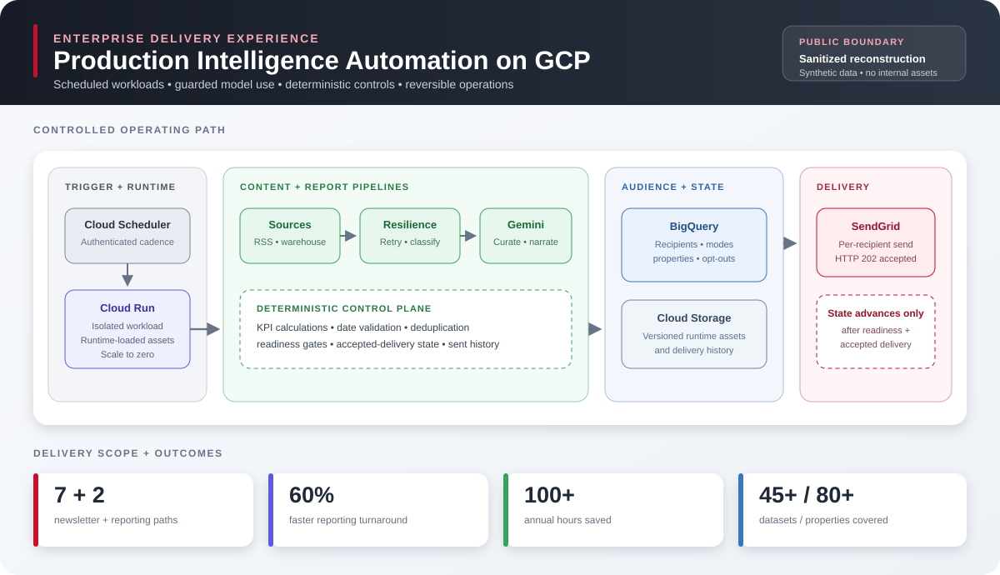
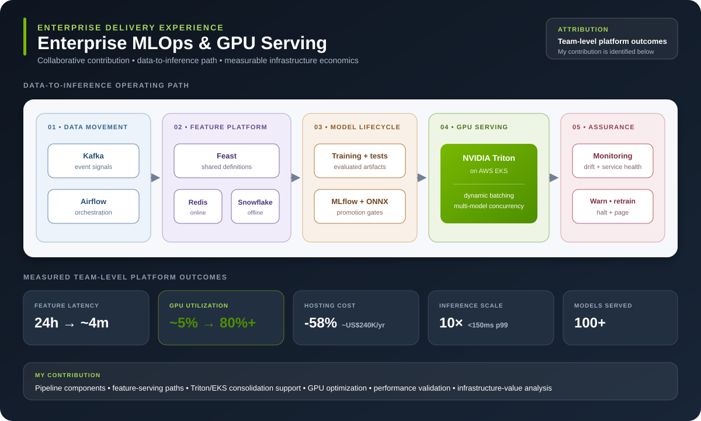
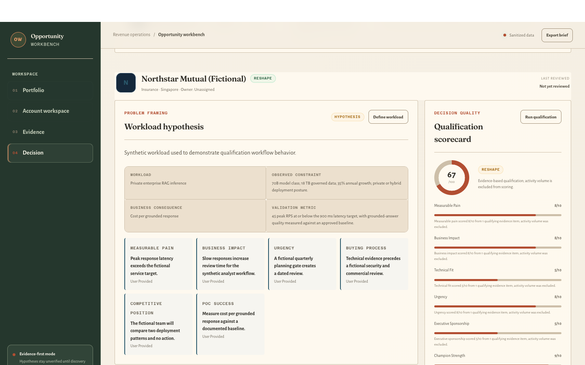
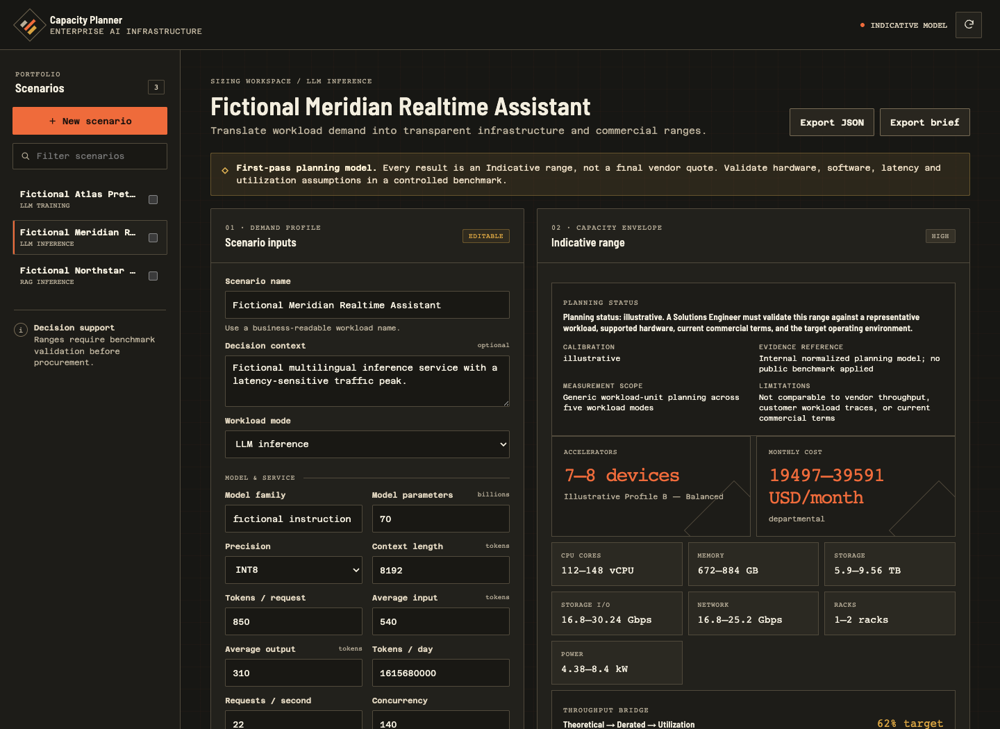
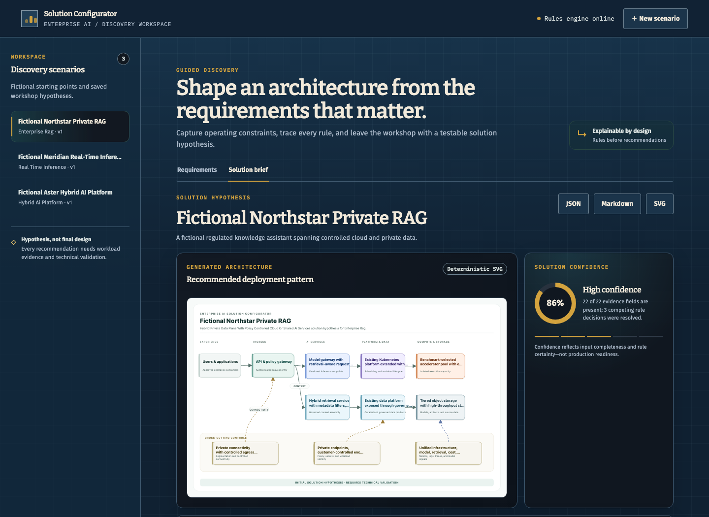
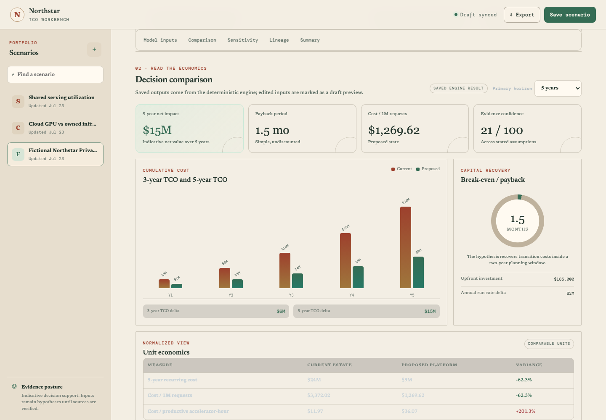

# Dae Tan | AI Infrastructure Solutions Portfolio

A technical-commercial portfolio spanning enterprise cloud and AI delivery, governed agentic analytics, MLOps and GPU serving, and independently built tools for the AI-infrastructure customer decision cycle.

The professional work covers systems I built or contributed to at Frasers Hospitality. The independent projects connect discovery, workload sizing, architecture framing, and financial justification into one reviewable workflow.

[LinkedIn](https://www.linkedin.com/in/dae-tan-1a2b3c) · [Enterprise delivery](#selected-enterprise-delivery) · [AI infrastructure solutions](#featured-ai-infrastructure-solutions) · [Worked Private-RAG case](docs/tco-worked-example.md) · [Value-engineering method](docs/value-engineering.md)

## Selected enterprise delivery

Professional work completed within Frasers Hospitality's Digital Intelligence environment. Public diagrams and interfaces are sanitized reconstructions; production source code, company data, credentials, internal identifiers, prompts, endpoints, and screenshots are excluded.

### 1. Production Intelligence Automation on GCP

**Frasers Hospitality · Digital Intelligence · direct delivery and operation**

I helped turn recurring intelligence gathering and performance reporting into independently scheduled, governed cloud services.

- Built and refined seven newsletter workflows and two recurring reporting paths using Cloud Run, Cloud Scheduler, Cloud Storage, BigQuery, Vertex AI/Gemini, Secret Manager, and SendGrid.
- Added deterministic KPI calculation, readiness gates, resilient feed handling, recipient and opt-out configuration, encrypted preference tokens, accepted-delivery checks, and sent-history protection.
- Created reversible sandbox, UAT, and production procedures covering disabled-send validation, scheduler activation, environment configuration, migration, rollback, and day-two incident response.
- Contributed to a 60% reduction in reporting turnaround and 100+ annual hours saved; the wider reporting environment covered 45+ datasets and 80+ properties.

[`Read the GCP delivery case study`](docs/enterprise-delivery/gcp-intelligence-automation.md) · [`Open the sanitized GCP blueprint`](https://github.com/daetan999/gcp-data-platform-blueprint)

---

### 2. Enterprise MLOps & GPU Serving

**Frasers Hospitality · collaborative platform contribution**

I contributed to the data, feature, model-serving, GPU-optimization, and infrastructure-value work behind a shared enterprise MLOps platform.

- Implemented and supported Kafka, Airflow, Feast, Redis, and Snowflake paths that reduced feature latency from 24 hours to approximately four minutes.
- Supported consolidation of 100+ models onto NVIDIA Triton serving on AWS EKS, including GPU optimization and performance validation.
- Connected utilization, throughput, p99 latency, feature freshness, and hosting cost to infrastructure and business decisions.
- Team-level outcomes included GPU utilization rising from approximately 5% to more than 80%, a 58% hosting-cost reduction (about US$240K annually), and 10× inference demand below 150 ms p99.

[`Read the MLOps delivery case study`](docs/enterprise-delivery/enterprise-mlops-gpu-serving.md) · [`Open the sanitized MLOps blueprint`](https://github.com/daetan999/mlops-hosp)

---

### 3. Governed FP&A Analytics Agent

**Frasers Hospitality · direct application build**

I built an ADK and BigQuery analysis workflow that turned natural-language finance and property-performance questions into governed, source-labelled results.

- Covered P&L, budget variance, occupancy, ADR, RevPAR, and property-performance questions through Google ADK, Gemini on Vertex AI, BigQuery, and a Next.js request boundary.
- Separated model planning and explanation from deterministic SQL calculation, with approved data objects, source-specific property resolution, byte caps, result limits, KPI-semantic rules, and data-quality checks.
- Reduced common ad hoc extraction from hours to under two minutes while keeping raw KPI components and source context available for review.

[`Open the governed FP&A agent blueprint and reconstructed interface`](https://github.com/daetan999/adk-fpa-agent-blueprint)

## Featured AI infrastructure solutions

Four independently built workbenches cover one connected customer decision cycle. Each product uses a distinct interface because discovery, engineering sizing, architecture review, and investment analysis are different forms of work.

| Stage | Decision | Product | Output |
|---|---|---|---|
| Discover | Is there a specific opportunity worth pursuing? | [Opportunity Workbench](https://github.com/daetan999/ai-infra-opportunity-workbench) | Workload hypothesis, stakeholder map, discovery gaps, and next action |
| Size | What infrastructure range and bottleneck require validation? | [Capacity Planner](https://github.com/daetan999/ai-infra-capacity-planner) | Low/base/high range, sensitivities, bottlenecks, and AE-to-SE validation plan |
| Configure | Which architecture hypothesis best fits the requirements? | [Solution Configurator](https://github.com/daetan999/ai-infra-solution-configurator) | Recommendation, alternatives, risks, architecture diagram, and validation gates |
| Justify | Is the proposed change financially defensible? | [TCO Workbench](https://github.com/daetan999/ai-infra-tco-workbench) | TCO, unit economics, sensitivity, payback, ROI, and executive report |

### 1. Opportunity & Discovery Workbench

**Account research, qualification, and bounded PoC handoff**

A field-research workspace for separating sourced account signals from seller interpretation. It turns workload hypotheses, stakeholder access, discovery notes, and unresolved risk into an advance, reshape, nurture, or disqualify recommendation.

Built with deterministic qualification, persistence, workflow APIs, a server-rendered interface, and JSON/Markdown exports. Fictional accounts and decision-support logic only; it is not a production CRM or revenue forecast.

[`Open the Opportunity Workbench`](https://github.com/daetan999/ai-infra-opportunity-workbench)

---

### 2. Capacity & Commercial Sizing Planner

**First-pass workload sizing for an AE-to-SE conversation**

An industrial planning desk that converts early workload assumptions into editable compute, memory, storage, network, power, and commercial ranges across training, fine-tuning, batch inference, real-time inference, and RAG.

Built with a deterministic sizing engine, YAML accelerator profiles, scenario persistence, comparison, sensitivity, and exports. Outputs are indicative planning ranges—not benchmarks, supplier quotes, topology validation, or a final bill of materials.

[`Open the Capacity Planner`](https://github.com/daetan999/ai-infra-capacity-planner)

---

### 3. Enterprise AI Solution Configurator

**Requirements-led architecture recommendation and validation planning**

A blueprint workspace that turns structured requirements into an explainable solution hypothesis, viable alternatives, risk notes, validation gates, and a controlled architecture diagram.

Built with versioned recommendation rules, deterministic diagram generation, scenario persistence, exports, and browser-tested decision flows. The result is an initial hypothesis—not a final architecture, security approval, benchmark, quote, or bill of materials.

[`Open the Solution Configurator`](https://github.com/daetan999/ai-infra-solution-configurator)

---

### 4. TCO & ROI Workbench

**Value engineering and executive business-case review**

A financial review desk for comparing infrastructure operating models across three- and five-year TCO, unit economics, payback, modeled ROI, and sensitivity while preserving the assumptions behind every result.

Built with a Decimal-based financial engine, immutable scenario versions, assumption gating, sensitivity analysis, and JSON/CSV/PDF exports. Values are fictional or user-entered—not live pricing, supplier terms, financial advice, or guaranteed ROI.

[`Open the TCO Workbench`](https://github.com/daetan999/ai-infra-tco-workbench)

## Additional technical build

### HR Timesheet & Approval Tool

A working FastAPI application for replacing paper and spreadsheet-based time capture with document intake, field normalization, deterministic validation, exception review, reference-data management, approval controls, and payroll-ready Excel export.

The public prototype runs with synthetic employee data and mock extraction, while preserving idempotent records, audit fields, reviewed-data protection, and a documented promotion path to production persistence and identity controls.

**Technology:** Python · FastAPI · Jinja2 · PyMuPDF · Pillow · openpyxl

[`Open the HR Timesheet Tool`](https://github.com/daetan999/hr_timesheet_tool)

## Shared engineering approach

- Models interpret language and produce narrative; deterministic code owns scoring, sizing, financial calculations, KPI logic, state, and delivery decisions.
- Assumptions, inputs, source labels, limitations, and validation requirements remain visible beside outputs.
- Public repositories separate synthetic or sanitized material from professional outcomes and internal production assets.
- Architecture and commercial recommendations remain hypotheses until replaced by customer data, benchmarks, security review, technical approval, and supplier pricing.

## Public artifact standard

- Professional metrics are labelled as direct workflow outcomes or wider team-level platform outcomes.
- Public repositories do not reproduce proprietary production code, data, credentials, endpoints, prompts, or internal interfaces.
- Scenario values in independent projects are not presented as customer revenue, quota, or savings results.
- Prototype, blueprint, benchmark, production contribution, and production deployment are not used interchangeably.
- The [resume project mapping](docs/resume-project-mapping.md) keeps the paper resume concise while this repository holds the wider project set.

## License

Portfolio documentation is released under the [MIT License](LICENSE). Each linked repository carries its own license and public-artifact boundary.
