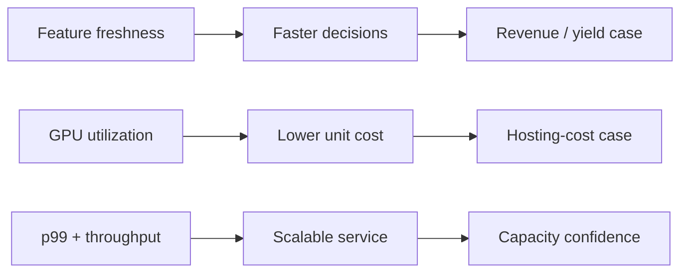

# Enterprise MLOps & GPU Serving

**Frasers Hospitality · collaborative platform contribution · sanitized professional case study**

> This case study describes my contribution within a wider delivery team. Team-level platform outcomes are labelled as such. Public diagrams are sanitized reconstructions; proprietary code, data, clusters, endpoints, credentials, and internal interfaces are excluded.

## Executive summary

An enterprise ML portfolio spanning multiple business units needed faster feature delivery, governed model promotion, shared inference infrastructure, and a defensible link between technical performance and business value.

I contributed to pipeline components, feature-serving paths, shared NVIDIA Triton serving on AWS EKS, GPU optimization, validation, and infrastructure-value analysis. I did not act as the sole architect of the entire platform.

## My contribution

| Workstream | Contribution |
|---|---|
| Data and orchestration | Implemented and supported Kafka and Airflow pipeline components for batch and near-real-time movement |
| Feature platform | Worked with Feast, Redis, and Snowflake paths supporting online/offline consistency and faster feature freshness |
| Model serving | Supported consolidation of 100+ models onto shared NVIDIA Triton serving on AWS EKS |
| GPU optimization | Contributed to utilization, batching, concurrency, latency, throughput, and hosting-cost analysis |
| Technical-commercial analysis | Translated feature freshness, p99 latency, inference scale, utilization, and unit cost into operating and financial implications |
| Enterprise communication | Helped communicate architecture, controls, outcomes, and trade-offs across technical and business stakeholders |

## Architecture and operating logic

1. Kafka and Airflow move operational, telemetry, and external signals.
2. Feast maintains shared feature definitions, with Redis for online access and Snowflake for point-in-time offline retrieval.
3. Training and evaluation paths promote governed artifacts through a model registry.
4. Compatible models are converted to ONNX and served through NVIDIA Triton on EKS.
5. Monitoring separates drift warnings, retraining triggers, and halt-and-page conditions.
6. GPU placement remains a benchmarked decision: shared serving is used only where memory fit, isolation, latency, and traffic shape support it.

## Measured team-level platform outcomes

| Measure | Reported outcome | Why it matters commercially |
|---|---:|---|
| Feature latency | 24 hours → ~4 minutes | Faster signals can support more responsive operational and pricing decisions |
| GPU utilization | ~5% → >80% | Higher productive density improves infrastructure economics |
| Hosting cost | -58% (~US$240K/year) | Converts a technical optimization into an auditable run-rate impact |
| Inference demand | 10× at <150 ms p99 | Demonstrates scale without abandoning the agreed service-level target |
| Forecast accuracy | 8% MAPE | Establishes the technical measure behind downstream planning outcomes |
| Revenue and margin | +4.2% RevPAR; +S$4.8M GOP | Aggregate platform outcomes; attribution depends on the wider operating model |
| Yield capture | ~S$1.2M annually | Reported value associated with faster feature and pricing workflows |

These were collaborative platform results. My portfolio claim is contribution to the systems and analysis behind them—not sole ownership of every component or outcome.

## GPU-serving validation framework

Shared Triton serving was treated as a hypothesis to prove, not an automatic upgrade.

| Acceptance area | Baseline | Test | Gate |
|---|---|---|---|
| Model fit | Memory footprint and isolation needs | Load the representative model mix | No unsafe eviction or interference |
| Utilization | Steady-state and peak accelerator use | Replay representative traffic with batching and concurrency | Higher productive utilization |
| Service level | p50, p95, and p99 by load | Increase load until saturation | p99 remains below the agreed target |
| Scale | Current throughput and burst profile | Run sustained and burst tests | Target demand clears with headroom |
| Reliability | Error rate, restart, and failure behavior | Inject model and pod failures | Recovery stays within the operating objective |
| Economics | Fleet cost and cost per inference | Recalculate using measured throughput | Savings survive sensitivity analysis |

## Technical-to-commercial transmission

The diagram is deliberately directional rather than causal proof. A technical improvement becomes a business claim only after a baseline, measurement period, attribution method, and finance or operating-owner validation are defined.

## Trade-offs I can defend

### Shared versus dedicated serving

Shared GPU serving can improve density, but incompatible memory footprints, latency objectives, isolation requirements, or traffic patterns may justify dedicated pools.

### Online speed versus platform complexity

Feast and Redis can reduce feature latency and training-serving skew, but they add operational ownership, observability, and data-contract requirements. Not every workload needs an online store.

### Automation versus model risk

Automatic retraining shortens response time, but severe drift, label failure, or business-rule changes may require a halt and human review rather than automatic promotion.

### Savings versus attribution

Infrastructure savings can be measured from fleet and utilization data. Revenue, RevPAR, yield, and GOP require stronger attribution because model changes operate alongside pricing policy, demand, distribution, and commercial execution.

## What this case proves

This case is evidence that I can engage credibly with infrastructure and MLOps specialists, understand the technical path from data to GPU serving, challenge weak ROI logic, and translate benchmark evidence into a commercial discussion.

## Public evidence

- [Sanitized Enterprise MLOps Platform blueprint](https://github.com/daetan999/mlops-hosp)
- [Return to the technical portfolio](../../README.md)
