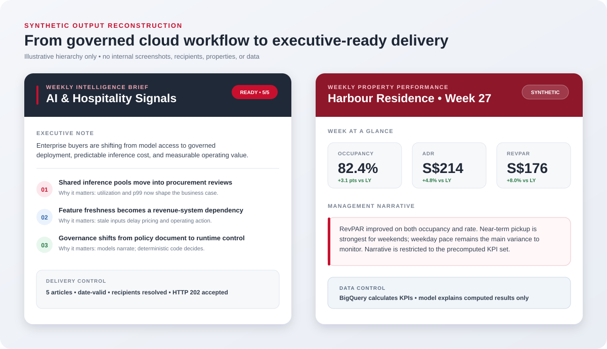

# Production Intelligence Automation on GCP

**Frasers Hospitality · Digital Intelligence · sanitized professional case study**

> All visuals and examples in this case study are sanitized reconstructions using synthetic data. Proprietary code, datasets, prompts, credentials, recipients, internal identifiers, screenshots, and infrastructure details are excluded.

## Executive summary

Recurring intelligence newsletters and property-performance reports required reliable sourcing, controlled model use, deterministic business calculations, and scheduled delivery. I helped build, productionize, migrate, and operate a set of serverless Google Cloud workflows that converted those recurring tasks into governed services.

The work covered seven newsletter workflows and two performance-reporting paths. My contribution included application logic, cloud runtime patterns, reliability controls, recipient and preference management, deployment documentation, testing, migration, and day-two incident resolution.

## The operating problem

The challenge was not simply generating text with an LLM. A production workflow had to answer harder questions:

- Can each source be trusted and retried without silently treating a blocked page as “no news”?
- Which decisions belong to deterministic code, and which can safely use a model?
- What conditions must stop a send instead of degrading gracefully?
- How are recipients, modes, property mappings, and opt-outs managed without editing every script?
- How can sandbox, UAT, and production be promoted and rolled back safely?
- How is delivery acceptance distinguished from a locally successful function call?

## What I delivered

| Workstream | Contribution |
|---|---|
| Intelligence workflows | Built and refined seven topic-specific newsletter paths with screening, ranking, diversity, summary, validation, and delivery stages |
| Performance reporting | Built recurring weekly and monthly paths using deterministic BigQuery calculations before model-generated narrative |
| Runtime pattern | Implemented Cloud Run services invoked by Cloud Scheduler, with runtime assets loaded from Cloud Storage and configuration supplied by environment |
| Audience controls | Implemented BigQuery-backed recipient resolution, send modes, property mapping, activation state, and opt-out handling |
| Reliability | Added RSS retry/backoff and health classification, readiness gates, accepted-delivery checks, and sent-history protection |
| Privacy and preferences | Implemented encrypted preference tokens, confirmation-before-write behavior, and idempotent BigQuery updates |
| Promotion and migration | Created reversible sandbox/UAT/production procedures with paused schedulers, disabled-send checks, validation, and rollback |

## Model boundary

The model was not permitted to own calculations or delivery state.

| Deterministic system responsibility | Model responsibility |
|---|---|
| Date windows, deduplication, readiness thresholds, KPI calculation, recipient rules, preference enforcement, delivery acceptance, and sent history | Relevance screening, diversity-aware ranking, concise summarization, and narrative generation from precomputed metrics |

This separation reduced the risk of a fluent response silently changing a business calculation or operational decision.

## Failure policy

| Failure class | Policy | Reason |
|---|---|---|
| Optional preference-link generation unavailable | Degrade and omit the footer link | The optional interface should not block an otherwise valid operational delivery |
| Source temporarily rate-limited | Retry, classify, and continue if the content threshold is still met | One recoverable source should not take down the entire topic workflow |
| Recipient or opt-out lookup unavailable | Stop | Sending without authoritative audience controls creates a compliance risk |
| Performance data stale or report not ready | Stop | An incomplete report should not be delivered as authoritative |
| Delivery response is not HTTP 202 | Record failure; do not count as accepted | Local execution does not prove provider acceptance |
| No accepted deliveries | Do not advance sent history | Content must remain eligible for a safe retry |

## Synthetic output reconstruction

The reconstruction illustrates the information hierarchy and deterministic/model boundary. It is not an internal screenshot.

## Outcomes

- Seven recurring newsletter workflows and two performance-reporting paths.
- Approximately 60% faster reporting turnaround and 100+ annual hours saved across recurring delivery.
- Wider reporting coverage spanning 45+ datasets and 80+ properties.
- Independently pausable services and schedules instead of one coupled deployment.
- Reviewable recipient, preference, delivery, and sent-history controls.

## Technical decisions and trade-offs

### Serverless workload isolation

Each workflow ran as an independently scheduled Cloud Run service. This increased the number of deployable units, but limited blast radius, allowed per-workload pausing, and avoided paying for idle compute.

### Configuration as governed data

Recipient type, mode, activation state, and property mapping were stored in BigQuery rather than scattered through scripts. This made operating changes auditable, but required hard-fail behavior when authoritative configuration could not be read.

### Controlled use of generative AI

Gemini curated and narrated; deterministic code owned calculations and state. This added validation stages, but made failures explainable and reduced the chance that generated prose could alter the decision basis.

### Runtime-loaded artifacts

Cloud Run runners loaded approved scripts and helpers from Cloud Storage. This simplified workload replication, but required strict version, helper, environment, and working-directory controls during promotion.

## Public evidence

- [Sanitized GCP Data & Intelligence Platform blueprint](https://github.com/daetan999/gcp-data-platform-blueprint)
- [Return to the AI Infrastructure Solutions Portfolio](../../README.md)
