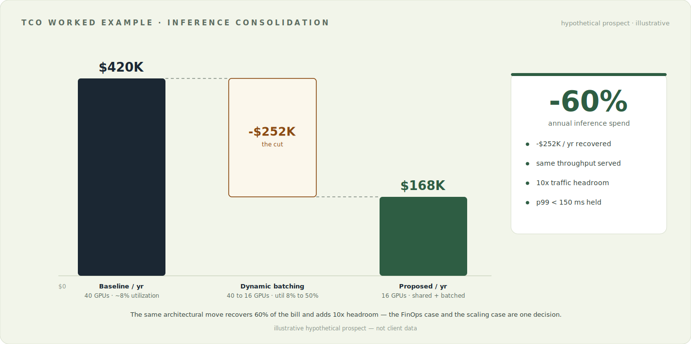

# TCO Worked Example — Consolidating an Inference Startup's Idle GPU Spend

> A single hypothetical prospect walked end-to-end through the [value-engineering
> motion](value-engineering.md) — discovery, value hypothesis, TCO model, PoC
> criterion, and the CFO one-liner. **The prospect and the numbers are fictional
> illustrations; the method is the real one.** This is what a first-call-to-business-case
> looks like when a sales engineer runs it.

For an implemented deterministic calculator, sensitivity model, lineage view, and executive export, see the [Enterprise AI Infrastructure TCO & ROI Workbench](https://github.com/daetan999/ai-infra-tco-workbench) and its [fictional sample report](https://github.com/daetan999/ai-infra-tco-workbench/blob/product-build/docs/examples/fictional-cpu-to-gpu-business-case.pdf).

---

## The prospect (discovery snapshot)

**"NimbusAI"** — a Series-B GenAI company serving ~30 fine-tuned models (per-customer
variants) behind a real-time API. Traffic is bursty and diurnal. Symptoms the VP of
Engineering opened with:

- Cloud bill is the #2 line item and growing faster than revenue.
- Each model runs on its own dedicated GPU instance "to keep tenants isolated."
- Scaling a new customer means adding another GPU — cost is **linear with logos**.
- P99 latency spikes during traffic bursts; they over-provision to hide it.

## Discovery → the numbers that matter

The questions that turned the symptoms into a model (from the [question bank](value-engineering.md#discovery--quantification-the-question-bank)):

| Question | Answer |
|---|---|
| GPU utilization at steady state? | **~8%** — instances sized for peak, idle most of the day |
| Dedicated vs. shared serving? | **40 GPUs, one model per instance**, no sharing |
| Current annualized GPU spend? | **≈ $420K/yr** (40 × ~$1.2/hr-class instances) |
| p99 target and cost of a miss? | **< 150 ms**; timeouts drop API calls and churn design-partners |
| Cost of an idle-capacity hour? | Never measured — which is itself the finding |
| Time-to-market for a new tenant? | Days — procure + configure a new instance |

**The economic buyer's metric:** cloud-cost-as-%-of-revenue, and the scaling curve
that makes it worse with every new customer.

## The value hypothesis (one sentence)

> *"If we consolidate your 30 models onto a shared, dynamically batched GPU pool, we
> take utilization from ~8% to ~50%, cut the GPU count from 40 to ~16, and hold p99
> under 150 ms — that's roughly **−$252K/year** and a scaling curve that no longer
> tracks your logo count."*

Wrong-but-specific on purpose: it gives NimbusAI exact numbers to challenge, and every
challenge surfaces a real input for the model.

## The TCO model

| Lever | Baseline | Proposed | Mechanism |
|---|---|---|---|
| Serving topology | 1 GPU per model (40) | shared batched pool (~16) | multi-model concurrency in shared GPU memory |
| GPU utilization | ~8% | ~50% | dynamic batching packs bursty low-QPS calls into dense work |
| Annual GPU spend | **$420K** | **$168K** | fewer instances at higher density |
| Scaling cost curve | linear per tenant | sub-linear (headroom absorbs growth) | new models load into existing pool, not new hardware |
| Peak handling | over-provisioned | **10× burst headroom** | batching smooths spikes instead of pre-buying for them |
| p99 latency | ~150 ms (fragile at peak) | **< 150 ms held** | batching window capped at ~10 ms |
| **Net** | — | **−$252K/yr (−60%)** | the FinOps win and the SLA win are one move |

## The PoC success criterion (falsifiable)

Not "try batching" — a test that can fail:

> **On NimbusAI's own traffic replay, serve their 30 models on ≤ 16 GPUs at
> p99 < 150 ms while sustaining 10× their current peak QPS, over a 72-hour soak —
> and show the per-1K-inference cost at ≤ 40% of today's.**

If any threshold misses, the hypothesis is wrong and we say so. That is what makes the
number defensible when the champion carries it upstairs.

## The hand-off: what the champion repeats

**To the CFO:** *"We can serve the same traffic for about $168K instead of $420K —
$252K a year back — and it scales with usage, not customer count."*

**To their board:** *"Our cost-to-serve stops tracking logo growth; gross margin
improves as we add customers instead of degrading."*

## The expansion (why the first workload is a wedge)

The shared pool, the batching layer, and the utilization telemetry that land in the PoC
are the same substrate the next workloads ride on — new model families, autoscaling
policy, a feature store. The first deal is priced on −$252K; the account grows because
the architecture makes workload #2 and #3 a configuration change, not a new
procurement.

---

*Every figure above is an illustrative, portfolio-level construction for a fictional
prospect — no client data. The mechanism (utilization → GPU count → annual spend, with
p99 held) is the transferable part.*

---

[Back to the Enterprise AI Infrastructure Portfolio](../README.md)
